# Gruyere – Aufgabe A, B1 und B2

## A) Gruyere starten und Accounts erstellen

Ich habe Gruyere über folgende URL gestartet:

```text
https://google-gruyere.appspot.com/start
```

Danach wurde automatisch meine eigene Gruyere-Instanz erstellt.

Meine Gruyere-URL:

```text
https://google-gruyere.appspot.com/509171197644337749554007650008113036143/
```

Meine UID:

```text
509171197644337749554007650008113036143
```

Screenshot mit sichtbarer UID:

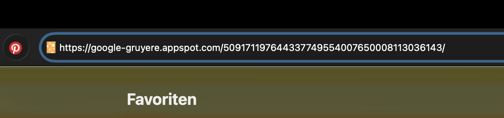

Ich habe zwei Accounts erstellt:

| Rolle       | Benutzername       |
| ----------- | ------------------ |
| Angreifer   | `angreifer-mena`   |
| Verteidiger | `verteidiger-mena` |

Beide Accounts wurden in zwei verschiedenen Browserfenstern geöffnet, damit zwei Benutzer simuliert werden können.

Screenshot beider Accounts:

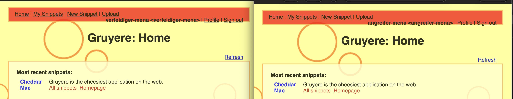

---

## B1 – Stored XSS: DOM-Manipulation

Als Angreifer wurde folgender Payload im Snippets-Feld gespeichert:

```html

```

Nach dem Neuladen wurde das Menü rot. Das zeigt, dass der JavaScript-Code ausgeführt wurde.

Screenshot:


Auch im Fenster des Verteidigers wurde das Menü rot. Das zeigt, dass der Payload gespeichert wurde und bei anderen Benutzern ebenfalls ausgeführt wird. Es handelt sich also um Stored XSS.

### Antworten B1

Der Payload konnte ausgeführt werden, weil kein `<script>`-Tag benutzt wurde. Stattdessen wurde ein `onerror`-Event in einem ``-Tag verwendet. Das Bild lädt nicht, deshalb wird `onerror` ausgelöst und der JavaScript-Code läuft.

Dass der Payload auch beim Verteidiger ausgeführt wird, ist gefährlich. Der Code liegt gespeichert auf dem Server und wird an andere Benutzer ausgeliefert. Ein Angreifer könnte damit Seiten manipulieren, Aktionen auslösen oder Cookies stehlen.

Stored XSS gehört zur OWASP Top 10:2025 Kategorie:

```text
A05:2025 – Injection
```

OWASP zählt Cross-Site Scripting zu Injection-Angriffen.

Die Applikation hätte Output Encoding verwenden müssen. Zeichen wie `<`, `>`, `"`, `'` und `&` müssten als Text ausgegeben werden, damit der Browser sie nicht als HTML oder JavaScript ausführt.

---

## B2 – Cookies: Was sie sind und warum sie gefährlich sind

In den DevTools wurde folgender Gruyere-Cookie gefunden:

| Name      | Wert                                  | Domain                       | Pfad                                       | Typ     |
| --------- | ------------------------------------- | ---------------------------- | ------------------------------------------ | ------- |
| `GRUYERE` | `124818977\|angreifer-mena\|\|author` | `google-gruyere.appspot.com` | `/509171197644337749554007650008113036143` | Sitzung |

Screenshot DevTools mit Cookie:

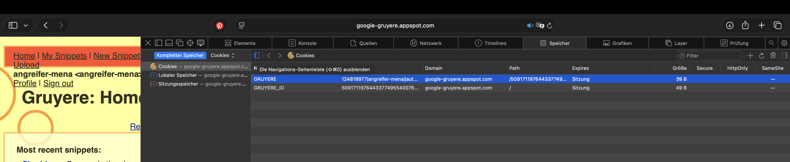

Danach wurde als Angreifer folgender Payload im Snippets-Feld eingefügt:

```html
Sichtbares Cookie: ' + document.cookie + '</div>')">
```

Nach dem Neuladen erscheint beim Angreifer ein roter Kasten mit dem eigenen Cookie:

```text
GRUYERE=124818977|angreifer-mena||author
```

Screenshot roter Kasten Angreifer:

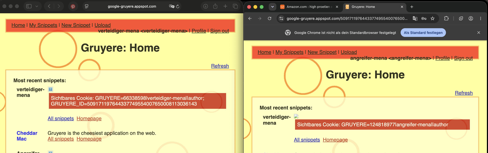

Im Fenster des Verteidigers erscheint im roten Kasten der Cookie des Verteidigers. Es wird also immer der Cookie des aktuell angemeldeten Benutzers angezeigt, nicht einfach der Cookie des Angreifers.

Screenshot roter Kasten Verteidiger:

### Antworten B2

Wenn ein Angreifer den Session-Cookie eines anderen Benutzers kennt, kann er möglicherweise dessen Sitzung übernehmen. Der Server erkennt den Cookie und denkt, der Angreifer sei der echte Benutzer. Dafür braucht der Angreifer kein Passwort.

Das `HttpOnly`-Flag schützt Cookies davor, mit JavaScript gelesen zu werden. Dann kann `document.cookie` diesen Cookie nicht anzeigen. Dadurch kann ein XSS-Payload den Session-Cookie nicht direkt auslesen.

`localStorage` ist gefährlicher für Session-Daten, weil JavaScript immer darauf zugreifen kann. Bei XSS könnte ein Angreifer den gespeicherten Token einfach auslesen und missbrauchen. Ein HttpOnly-Cookie ist deshalb sicherer für Sessions.

## B3 – Session-Hijacking: Cookie-Exfiltration zum Angreifer-Server

Für diese Aufgabe wurden zwei getrennte Browserfenster verwendet. Im ersten Browserfenster war der Benutzer `angreifer-mena` angemeldet, im zweiten Browserfenster der Benutzer `verteidiger-mena`. So konnten zwei unterschiedliche Sitzungen simuliert werden.

Zuerst wurde auf der EC2-Instanz ein Python-HTTP-Server auf Port 9000 gestartet. Dieser Server protokolliert alle eingehenden Anfragen direkt im Terminal. Dadurch konnte überprüft werden, ob der Cookie des Verteidigers beim Angreifer-Server ankommt.

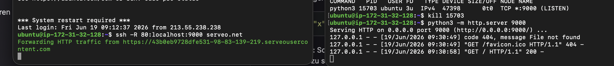

Danach wurde in einem zweiten SSH-Terminal ein Serveo-Tunnel gestartet. Dieser Tunnel stellte eine öffentliche HTTPS-Adresse bereit und leitete die Anfragen an den Python-Server auf Port 9000 weiter.

Die verwendete Serveo-Adresse war:

```text
https://43b0eb9728dfe531-98-83-139-219.serveousercontent.com
```

Anschliessend wurde als Angreifer folgender Payload in Gruyere gespeichert:

```html

```

Sobald der Verteidiger die Gruyere-Seite im zweiten Browserfenster öffnete, wurde dieser Payload in seinem Browser ausgeführt. Der Cookie wurde mit `document.cookie` ausgelesen und über die Serveo-Adresse an den Python-Server gesendet. Im Python-Terminal erschien danach eine GET-Anfrage mit dem Cookie in der URL.

Im nächsten Schritt wurde im Angreifer-Browser der aktuelle Gruyere-Cookie in den DevTools durch den Cookie des Verteidigers ersetzt. Nach dem Neuladen der Seite wurde die Sitzung des Verteidigers übernommen.

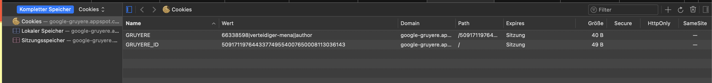

Nach der Cookie-Übernahme war ich als `verteidiger-mena` eingeloggt.

### Warum konnte der Angreifer den Cookie des Verteidigers erhalten, ohne dessen Passwort zu kennen?

Der Angreifer konnte den Cookie erhalten, weil der gespeicherte XSS-Payload im Browser des Verteidigers ausgeführt wurde. Der Browser des Verteidigers hatte Zugriff auf seinen eigenen Session-Cookie. Das eingeschleuste JavaScript konnte diesen Cookie auslesen und an den Angreifer-Server senden. Das Passwort war nicht nötig, weil die Webapplikation die Sitzung über den Cookie erkennt.

### Welche Rolle spielt `new Image().src`?

`new Image().src` erstellt im Hintergrund eine Anfrage an eine andere Adresse. Browser erlauben solche Anfragen, weil Webseiten Bilder auch von fremden Domains laden dürfen. Die Same-Origin-Policy verhindert hauptsächlich, dass eine Webseite die Antwort einer fremden Domain ausliest. Sie verhindert aber nicht, dass eine Anfrage an eine fremde Domain gesendet wird.

### Warum war der Serveo-Tunnel notwendig?

Der Serveo-Tunnel war notwendig, weil Gruyere über HTTPS läuft. Wenn der Payload direkt `http://<EC2-IP>:9000` verwendet hätte, hätte der Browser die Anfrage als Mixed Content blockieren können. Durch Serveo war der Angreifer-Server über HTTPS erreichbar. Deshalb wurde die Anfrage vom Browser zugelassen.

### Welche Massnahmen hätten diesen Angriff verhindert?

Eine wichtige Massnahme wäre das `HttpOnly`-Flag beim Session-Cookie. Dadurch könnte JavaScript den Cookie nicht mehr mit `document.cookie` auslesen. Zusätzlich müsste die Applikation Benutzereingaben korrekt escapen, also Output Encoding verwenden. Dann würde der eingefügte HTML- oder JavaScript-Code nicht ausgeführt werden.

### Was bewirkt das Secure-Flag?

Das `Secure`-Flag sorgt dafür, dass ein Cookie nur über HTTPS übertragen wird. Dadurch wird verhindert, dass der Cookie über eine unsichere HTTP-Verbindung gesendet wird. Es schützt also vor allem bei unverschlüsselten Verbindungen. Gegen das Auslesen durch JavaScript schützt es aber nicht; dafür braucht es `HttpOnly`.

## C – Reflected XSS in Gruyere

Bei Reflected XSS wird der Payload nicht gespeichert, sondern direkt über die URL an die Applikation übergeben. Der Server gibt diesen Wert danach direkt in der HTML-Antwort zurück. Dadurch ist nur die Person betroffen, die den manipulierten Link öffnet.

Meine Gruyere-UID lautet:

```text
509171197644337749554007650008113036143
```

### Schritt 1 – Reflection-Punkt finden

Zuerst wurde geprüft, ob ein Wert aus der URL auf der Seite wieder angezeigt wird. Dafür wurde der Parameter `uid` auf der Snippet-Seite getestet:

```text
https://google-gruyere.appspot.com/509171197644337749554007650008113036143/snippets.gtl?uid=HELLOWORLD
```

Der Wert `HELLOWORLD` wurde auf der Seite angezeigt. Dadurch wurde bestätigt, dass die Eingabe aus der URL in der Antwort der Webseite reflektiert wird.

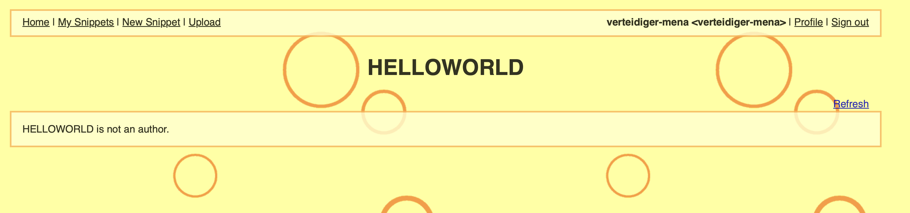

Danach wurde getestet, ob auch HTML-Code gerendert wird. Dafür wurde `HELLOTEST` als HTML-Überschrift eingefügt:

```text
https://google-gruyere.appspot.com/509171197644337749554007650008113036143/snippets.gtl?uid=<h1>HELLOTEST</h1>
```

`HELLOTEST` wurde als grosse Überschrift angezeigt. Damit wurde bestätigt, dass die Eingabe nicht korrekt escaped wird und HTML-Injection möglich ist.

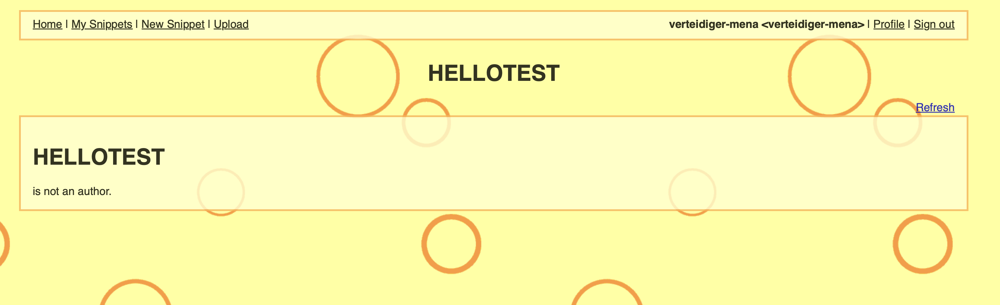

### Schritt 2 – XSS-Payload einschleusen

Anschliessend wurde der harmlose HTML-Test durch einen JavaScript-Payload ersetzt. Dafür wurde ein ``-Tag mit `onerror` verwendet:

```text
https://google-gruyere.appspot.com/509171197644337749554007650008113036143/snippets.gtl?uid=
```

Das Bild `x` kann nicht geladen werden. Deshalb wird das `onerror`-Event ausgelöst und der JavaScript-Code ausgeführt. Dadurch erschien ein Alert-Fenster im Browser. Der Alert zeigt, dass Reflected XSS funktioniert.

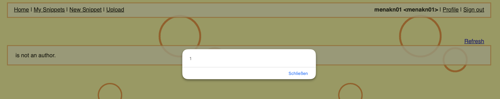

Danach wurde in den DevTools im Network-Tab die Anfrage geöffnet. Im Response-Tab war der Payload im HTML-Quelltext sichtbar. Damit wurde bestätigt, dass der Server den Payload aus der URL direkt in die HTML-Antwort eingefügt hat.


### Schritt 3 – Unterschied zu Stored XSS verstehen

Der manipulierte Link wurde danach im zweiten Browserfenster geöffnet. Dort war der Benutzer `verteidiger-mena` angemeldet. Auch beim Verteidiger wurde der Alert ausgelöst, sobald der manipulierte Link geöffnet wurde.

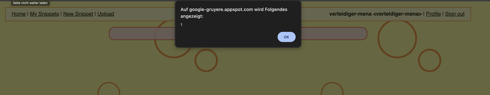

Danach wurde im Verteidiger-Fenster wieder die normale Gruyere-Startseite ohne Payload geöffnet:

```text
https://google-gruyere.appspot.com/509171197644337749554007650008113036143/
```

Auf der normalen Startseite erschien kein Alert mehr. Das zeigt, dass der Payload nicht gespeichert wurde. Der Code wird nur ausgeführt, wenn der manipulierte Link geöffnet wird.

### Was ist der Hauptunterschied zwischen Stored XSS und Reflected XSS?

Der Hauptunterschied liegt darin, ob der Payload gespeichert wird oder nicht. Bei Stored XSS wird der Payload in der Applikation gespeichert und später automatisch bei anderen Benutzern ausgeführt. Bei Reflected XSS wird der Payload nicht gespeichert. Er wird nur ausgeführt, wenn ein Benutzer genau den manipulierten Link öffnet.

### Wie würde ein Angreifer in der Praxis vorgehen?

Ein Angreifer würde dem Opfer einen manipulierten Link schicken, zum Beispiel per E-Mail, Chat oder über eine gefälschte Webseite. Der Link würde möglichst vertrauenswürdig aussehen. Sobald das Opfer den Link öffnet, wird der Payload im Browser des Opfers ausgeführt.

### Welcher OWASP Proactive Control schützt am direktesten gegen XSS?

Der passende OWASP Proactive Control ist:

```text
C4: Encode and Escape Data
```

Diese Massnahme schützt direkt gegen XSS, weil Benutzereingaben nicht als HTML oder JavaScript ausgeführt werden. Stattdessen werden gefährliche Zeichen wie `<`, `>`, `"`, `'` und `&` sicher als Text dargestellt.

## D – Client-State Manipulation in Gruyere

Bei dieser Aufgabe wurde untersucht, ob sicherheitsrelevante Informationen im Cookie gespeichert und vom Benutzer manipuliert werden können. Dafür wurde ein normales Benutzerkonto verwendet.

Der verwendete Benutzer war:

```text
menakn01
```

In den DevTools wurde unter **Storage / Cookies** der Gruyere-Cookie gesucht. Der relevante Cookie war:

```text
GRUYERE = 55949761|menakn01||author
```

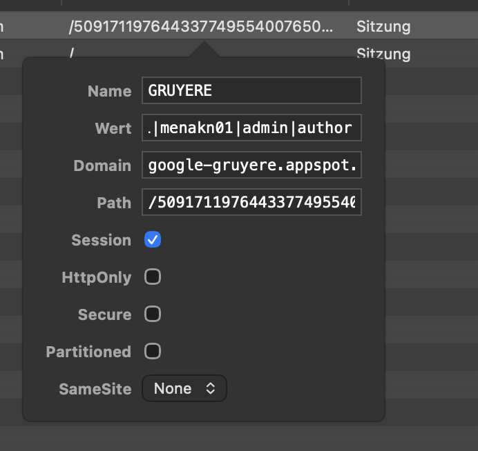

Laut Aufgabenstellung sollte der Cookie Base64-kodiert sein. Deshalb wurde zuerst versucht, den Wert im EC2-Terminal mit `base64 -d` zu dekodieren:

```bash
echo '55949761|menakn01||author' | base64 -d
```

Dabei erschien jedoch ein Fehler, weil der Cookie in meiner Gruyere-Instanz nicht Base64-kodiert war, sondern bereits lesbar vorlag.

Danach wurde der Cookie-Inhalt mit `awk` analysiert:

```bash
echo '55949761|menakn01||author' | awk -F'|' '{print "Prüfsumme:", $1; print "Benutzer:", $2; print "Admin-Feld:", $3; print "Rolle:", $4}'
```

Die Ausgabe war:

```text
Prüfsumme: 55949761
Benutzer: menakn01
Admin-Feld:
Rolle: author
```

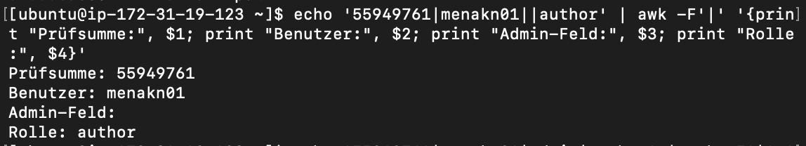

Der Cookie besteht also aus mehreren Teilen, die mit `|` getrennt sind. Das leere Admin-Feld zeigt, dass der Benutzer keine Admin-Rechte besitzt. Die Rolle `author` zeigt, dass es sich um einen normalen Benutzer handelt.

Anschliessend wurde der Cookie-Wert in den DevTools verändert. Der ursprüngliche Wert war:

```text
55949761|menakn01||author
```

Dieser Wert wurde geändert zu:

```text
55949761|menakn01|admin|author
```

Dadurch wurde im Cookie das leere Admin-Feld mit `admin` ersetzt. Danach wurde die Seite neu geladen, um zu prüfen, ob die Manipulation wirkt.

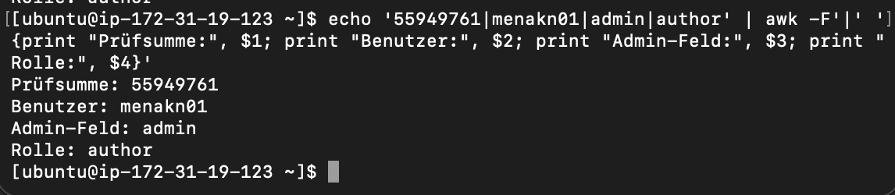

### Hat die Manipulation gewirkt?

Nach der Änderung des Cookies wurde die Seite neu geladen. Die Applikation hat den manipulierten Cookie übernommen und der Benutzer erhielt erhöhte Rechte. Dadurch wurde gezeigt, dass sicherheitsrelevante Informationen nicht nur im Client gespeichert und ungeprüft vertraut werden dürfen.

### Warum ist es gefährlich, sicherheitsrelevante Daten im Client zu speichern?

Es ist gefährlich, weil Daten im Browser vom Benutzer verändert werden können. Wenn Rollen oder Berechtigungen direkt im Cookie oder im localStorage gespeichert werden, kann ein Angreifer versuchen, diese Werte zu manipulieren. Dadurch könnte ein normaler Benutzer sich selbst Admin-Rechte geben oder auf Funktionen zugreifen, die eigentlich gesperrt sein sollten.

### Wo sollten Berechtigungsprüfungen stattfinden?

Berechtigungsprüfungen müssen auf dem Server stattfinden. Der Client kann zwar anzeigen, welche Buttons oder Menüs sichtbar sind, aber er darf nicht entscheiden, ob ein Benutzer wirklich Admin-Rechte hat. Der Server muss bei jeder wichtigen Aktion prüfen, ob der Benutzer die nötigen Rechte besitzt. Alles, was nur im Browser geprüft wird, kann manipuliert oder umgangen werden.

### Welche OWASP Top 10 Kategorie beschreibt dieses Problem?

Dieses Problem gehört zur OWASP Top 10 Kategorie:

```text
A01:2025 – Broken Access Control
```

Der Grund ist, dass ein Benutzer durch Manipulation von Client-Daten Zugriff auf Rechte erhalten kann, die ihm eigentlich nicht zustehen. Die Zugriffskontrolle ist dadurch fehlerhaft oder wird nicht korrekt serverseitig geprüft.
