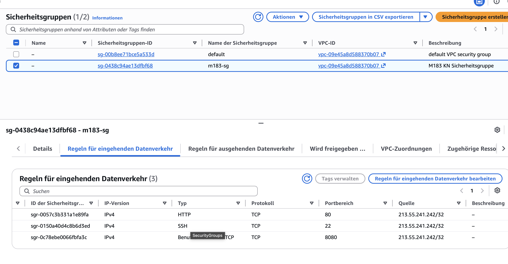
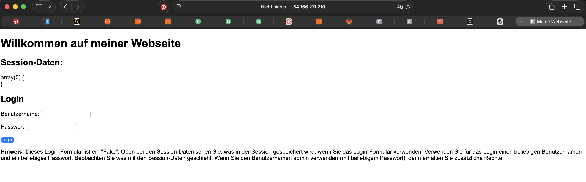
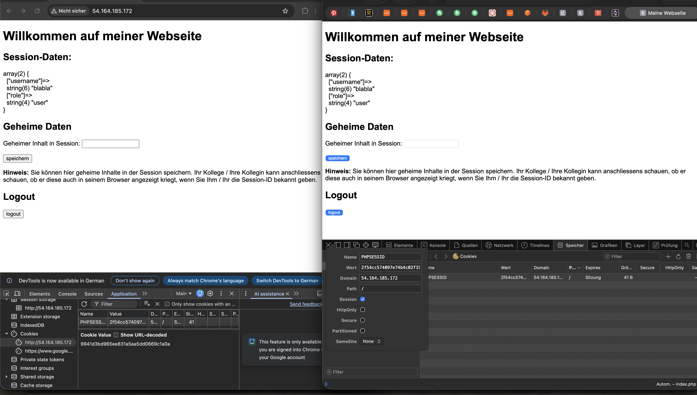

## KN03

## A – Sicherheitsgruppe erweitern und App deployen

Für diese Aufgabe wurde die PHP-App aus dem Modul-Repository auf meiner EC2-Instanz deployed. Die App läuft in einem Docker-Container und ist über Port `80` im Browser erreichbar.

### Schritt 1 – Port 80 freigeben

Zuerst wurde in AWS die bestehende Security Group `m183-sg` angepasst. Unter **Inbound rules** wurde eine neue Regel für HTTP hinzugefügt.

Die Regel wurde so gesetzt:

```text
Type: HTTP
Protocol: TCP
Port range: 80
Source: My IP
```

Der Port wurde nur für **My IP** freigegeben, damit die App nicht für alle öffentlich erreichbar ist.



### Schritt 2 – App deployen

Danach wurde eine SSH-Verbindung zur EC2-Instanz aufgebaut. Auf der Instanz wurde das Modul-Repository heruntergeladen. Die benötigten App-Dateien befinden sich im Ordner `AufgabeSource`.

Anschliessend wurde ein Apache-PHP-Container gestartet und der Ordner mit den App-Dateien in den Container eingebunden. Dadurch wird die PHP-App über den Webserver im Container ausgeliefert.

Nach dem Start wurde geprüft, ob der Container läuft. Danach konnte die App im Browser über die öffentliche EC2-IP geöffnet werden.



Damit war die App erfolgreich deployed und über HTTP erreichbar.

## B – Sicherheitslücken in der App analysieren

In der Datei `index.php` wurden mehrere Sicherheitslücken gefunden. Die App speichert Login- und Session-Daten sehr unsicher und prüft wichtige Sicherheitsmechanismen nicht korrekt.

### 1. Passwort wird nicht geprüft

Beim Login wird zwar ein Passwortfeld angezeigt, aber das Passwort wird im PHP-Code gar nicht überprüft. Es wird nur der Benutzername aus dem Formular in die Session gespeichert.

Dadurch kann sich jeder Benutzer mit einem beliebigen Passwort anmelden.

**Verletztes Schutzziel / OWASP:**
Confidentiality, OWASP Identification and Authentication Failures

---

### 2. Session-ID wird nach dem Login nicht erneuert

Nach dem Login wird keine neue Session-ID erstellt. Im Code fehlt `session_regenerate_id()`.

Dadurch könnte eine bereits bekannte oder gestohlene Session-ID weiterverwendet werden. Das kann zu Session Fixation führen.

**Verletztes Schutzziel / OWASP:**
Confidentiality und Integrity, OWASP Identification and Authentication Failures

---

### 3. Session-Cookies sind nicht geschützt

Die Session wird direkt mit `session_start()` gestartet. Es werden keine sicheren Cookie-Optionen wie `HttpOnly`, `Secure` oder `SameSite` gesetzt.

Dadurch sind die Session-Cookies schlechter geschützt. Sie könnten leichter bei Angriffen wie XSS oder CSRF missbraucht werden.

**Verletztes Schutzziel / OWASP:**
Confidentiality, OWASP Identification and Authentication Failures

---

### 4. Rolle wird nur über den Benutzernamen vergeben

Die Rolle wird unsicher vergeben. Wenn der Benutzername `admin` eingegeben wird, erhält der Benutzer automatisch die Rolle `admin`.

Es gibt keine echte Authentifizierung oder Prüfung, ob der Benutzer wirklich Administrator ist.

**Verletztes Schutzziel / OWASP:**
Integrity, OWASP Broken Access Control

---

### 5. Kein CSRF-Schutz vorhanden

Die Formulare für Login, Speichern und Logout verwenden keinen CSRF-Token.

Dadurch könnte eine fremde Webseite einen eingeloggten Benutzer dazu bringen, ungewollt eine Aktion auszuführen, zum Beispiel Daten zu speichern oder sich auszuloggen.

**Verletztes Schutzziel / OWASP:**
Integrity, OWASP Broken Access Control

---

Damit wurden fünf Sicherheitslücken in der App identifiziert.

# C – Session Fixation

## Hintergrund

Bei Session Fixation nutzt ein Angreifer aus, dass die Session-ID nach dem Login nicht erneuert wird. Er legt eine Session-ID vorab fest, lässt das Opfer sich damit einloggen und verwendet dann diese bekannte ID, um auf die Session des Opfers zuzugreifen.

## Durchführung

Die App wurde in zwei Browsern geöffnet (Chrome und Chrome Inkognito). Im ersten Browser wurde die Session-ID über DevTools → Application → Cookies → `PHPSESSID` ausgelesen:

```text
2f54cc574097e74b4c02f19aa0afed11
```

Dieser Wert wurde im zweiten Browser als `PHPSESSID`-Cookie gesetzt (DevTools → Cookies → Doppelklick auf den Wert → ersetzen). Danach hatten beide Browser dieselbe Session-ID.

Anschliessend wurde im ersten Browser eingeloggt (Benutzername `blabla`, beliebiges Passwort). Nach dem Neuladen des zweiten Browsers wurden dort dieselben Session-Daten angezeigt, obwohl im zweiten Browser kein Login stattfand:

```text
["username"]=> "blabla"
["role"]=> "user"
```



## Schriftliche Antworten

**1. Was ist passiert? Konnte der zweite Browser auf die Session des ersten zugreifen?**
Ja. Beide Browser hatten dieselbe `PHPSESSID`. Nach dem Login im ersten Browser wurden die Session-Daten (`username: blabla`, `role: user`) auch im zweiten Browser angezeigt, ohne dass dort ein eigener Login nötig war. Der zweite Browser konnte also allein über die bekannte Session-ID auf die authentifizierte Session zugreifen.

**2. Warum ist das ein Sicherheitsproblem?**
Die App erneuert die Session-ID beim Login nicht. Ein Angreifer kann dem Opfer eine ihm bekannte Session-ID unterschieben. Sobald sich das Opfer damit einloggt, ist die Session authentifiziert, und der Angreifer hat mit derselben ID vollen Zugriff auf das Konto, ohne die Zugangsdaten zu kennen.

**3. Welche eine Massnahme hätte diesen Angriff verhindert?**
Beim Login muss die Session-ID mit `session_regenerate_id(true)` neu generiert werden. Dadurch wird die alte, dem Angreifer bekannte ID ungültig und das Opfer erhält eine frische, unbekannte Session-ID.

# D – Sicherheitslücken beheben

Zuerst wurde eine Kopie der Originaldatei erstellt (`index_original.php`), danach `index.php` mit drei Fixes bearbeitet.

## Fix 1 – Session-ID nach Login erneuern

Im erfolgreichen Login-Block wurde `session_regenerate_id(true)` eingefügt. Nach dem Login erhält der Benutzer damit eine neue Session-ID, die alte (dem Angreifer eventuell bekannte) wird ungültig. Das macht Session Fixation unmöglich. Der Parameter `true` löscht die alte Session-Datei auf dem Server.

## Fix 2 – Passwort-Hashing mit Argon2ID

Die ursprüngliche App prüfte das Passwort gar nicht, jeder Benutzername/Passwort wurde akzeptiert. Oberhalb von `session_start()` wurde ein Array mit gehashten Passwörtern eingefügt:

```php
$users = [
    'admin' => password_hash('geheim123', PASSWORD_ARGON2ID),
    'alice' => password_hash('passwort', PASSWORD_ARGON2ID),
];
```

Der Login-Block prüft das Passwort nun mit `password_verify()`. Nur bei korrektem Benutzernamen und Passwort wird die Session gesetzt, sonst erscheint eine Fehlermeldung:

```php
if(isset($_POST['login'])) {
    $username = $_POST['username'];
    $password = $_POST['password'];

    if(isset($users[$username]) && password_verify($password, $users[$username])) {
        session_regenerate_id(true);
        $_SESSION['username'] = $username;
        $_SESSION['role'] = ($username === 'admin') ? 'admin' : 'user';
    } else {
        $error = 'Benutzername oder Passwort ist falsch.';
    }
}
```

Getestet wurde mit den zwei vorgegebenen Konten `admin` / `geheim123` (Rolle admin) und `alice` / `passwort` (Rolle user). Ein falsches Passwort wird abgelehnt, es entsteht keine gültige Session.

## Fix 3 – Cookie-Flags setzen

Die Cookie-Flags wurden direkt vor `session_start()` gesetzt:

```php
session_set_cookie_params([
    'lifetime' => 900,        // 15 Minuten Timeout
    'secure'   => true,       // Nur über HTTPS senden
    'httponly' => true,       // Kein Zugriff via JavaScript
    'samesite' => 'Strict',   // Kein Cross-Site-Senden
]);
```

### Hinweis zur Testumgebung

Die App läuft in der Testumgebung über HTTP. Ein Cookie mit `secure => true` wird vom Browser über HTTP nicht gesetzt, da Secure-Cookies nur über HTTPS erlaubt sind. Für die Video-Demonstration wurden daher `secure => false` und `samesite => Lax` verwendet, damit der Login überhaupt funktioniert. Das Flag `HttpOnly` greift auch über HTTP und ist in den DevTools als angehakt sichtbar. In einer produktiven HTTPS-Umgebung bleiben `secure => true` und `SameSite=Strict` die korrekten Einstellungen.

## Schriftliche Antworten

**1. Was bewirkt `HttpOnly` und gegen welchen Angriff schützt es?**
`HttpOnly` verhindert, dass ein Cookie über JavaScript (`document.cookie`) ausgelesen werden kann. Es schützt vor Cross-Site Scripting (XSS): Selbst wenn ein Angreifer JavaScript einschleust, kann er die Session-ID nicht stehlen.

**2. Was bewirkt `SameSite=Strict` und gegen welchen Angriff schützt es?**
`SameSite=Strict` sorgt dafür, dass das Cookie nur bei Anfragen von derselben Webseite mitgeschickt wird, nicht bei Anfragen von fremden Seiten. Es schützt vor Cross-Site Request Forgery (CSRF), weil der Session-Cookie bei einer von aussen ausgelösten Anfrage nicht mitgesendet wird.

**3. Warum `PASSWORD_ARGON2ID` statt MD5 oder SHA-1?**
MD5 und SHA-1 sind schnelle Hash-Verfahren und gelten als unsicher: Sie lassen sich mit Brute-Force und Rainbow-Tables sehr schnell knacken und haben bekannte Kollisionen. Argon2ID ist ein moderner, bewusst langsamer Passwort-Hash mit Salt und hohem Speicherbedarf. Das macht Brute-Force und Rainbow-Table-Angriffe extrem aufwändig und schützt die Passwörter deutlich besser.

## Abgabe

- Video der DevTools mit Cookie-Flags (vorher ohne Fix, nachher mit Fix, `HttpOnly` sichtbar angehakt): [d-cookie-flags.mov](../public/d-cookie-flags.mov)
- Video der Anmeldung nach Fix 2 (falsches Passwort `admin`/`falsch` wird abgelehnt, richtiges `admin`/`geheim123` wird akzeptiert): [d-login-test.mov](../public/d-login-test.mov)
- Schriftliche Antworten auf die drei Fragen → siehe oben

# E – MFA-Faktoren erklären

## Hintergrund

Bei der Mehrfaktorauthentifizierung (MFA) werden Faktoren aus verschiedenen Kategorien kombiniert. Nur wenn Faktoren aus unterschiedlichen Kategorien kombiniert werden, spricht man von echtem MFA.

## Tabelle

| Kategorie | Beschreibung | Beispiel 1 | Beispiel 2 |
|---|---|---|---|
| Wissen | Etwas das Sie wissen | Passwort | PIN |
| Besitz | Etwas das Sie besitzen | Smartphone (Authenticator-App / SMS) | Hardware-Token (z. B. YubiKey) |
| Inhärenz | Etwas das Sie sind | Fingerabdruck | Gesichtserkennung |
| Ort | Wo Sie sich befinden | Bekannte IP-Adresse / Firmennetzwerk | GPS-Standort (z. B. Land, Geofencing) |

## Schriftliche Antworten

**1. Ist die Kombination «Passwort + PIN» echtes MFA?**
Nein. Passwort und PIN gehören beide zur Kategorie **Wissen**. Es werden also zwei Faktoren aus derselben Kategorie kombiniert. Echtes MFA erfordert Faktoren aus **unterschiedlichen** Kategorien. Diese Kombination ist deshalb nur eine stärkere Form der Wissensauthentifizierung (Zwei-Schritt-Verifikation), aber kein echtes MFA.

**2. Ist die Kombination «Passwort + SMS-Code» echtes MFA?**
Ja. Das Passwort gehört zur Kategorie **Wissen**, der SMS-Code wird an das Smartphone gesendet, das man **besitzen** muss (Kategorie Besitz). Es werden also zwei unterschiedliche Kategorien kombiniert, das erfüllt die Definition von echtem MFA.

**3. Welchem MFA-Prinzip ähnelt AWS STS am meisten, und warum?**
AWS STS stellt **temporäre, zeitlich begrenzte** Zugangsdaten aus. Das ähnelt am ehesten dem Prinzip **Besitz**: Nur wer die temporären Credentials aktuell besitzt, kann die Aktion ausführen. Da diese Credentials automatisch ablaufen, ist der Zugriff an den Moment des Besitzes gebunden, ähnlich wie ein Hardware-Token oder eine Authenticator-App, deren Code auch nur kurzzeitig gültig ist. Es handelt sich also nicht um MFA selbst, sondern um ein Konzept, das das Besitz-Prinzip nachbildet: Zugriff nur, solange man das (temporäre) Credential tatsächlich in der Hand hat.
