## K04

## A – Brute-Force-Angriff auf ein Web-Login

Für diese Aufgabe wurde eine bewusst verwundbare Login-App auf meiner EC2-Instanz erstellt. Die App läuft in einem Docker-Container und ist über Port `80` im Browser erreichbar.

Das Ziel dieser Aufgabe war es zu zeigen, wie ein Brute-Force-Angriff gegen ein Web-Login funktioniert. Dabei werden automatisch viele Passwörter ausprobiert, bis das richtige Passwort gefunden wird.

Die App ist absichtlich unsicher, weil es kein **Rate-Limiting** und keinen **Account-Lockout** gibt. Dadurch kann ein Angreifer beliebig viele Login-Versuche durchführen.

### Schritt 1 – Port 80 freigeben

Zuerst wurde in AWS die Security Group `m183-sg` angepasst. Unter **Inbound rules** wurde eine Regel für HTTP hinzugefügt.

Die Regel wurde so gesetzt:

```text
Type: HTTP
Protocol: TCP
Port range: 80
Source: My IP
```

Damit konnte die Login-App im Browser über die öffentliche EC2-IP aufgerufen werden.

### Schritt 2 – Verwundbare Login-App erstellen

Danach wurde über SSH eine Verbindung zur EC2-Instanz aufgebaut. Auf der Instanz wurde ein Ordner für die Brute-Force-App erstellt:

```bash
mkdir -p ~/bruteforce-app && cd ~/bruteforce-app
```

In diesem Ordner wurde die Datei `index.php` erstellt. In der App wurde ein Benutzer direkt im PHP-Code gespeichert:

```php
$users = [
    'admin' => 'sunshine',
];
```

Das Passwort des Benutzers `admin` lautet also `sunshine`.

Die Sicherheitslücke in der App ist, dass falsche Login-Versuche nicht begrenzt werden. Es gibt keine Sperre und keine Wartezeit nach mehreren falschen Passwörtern.

### Schritt 3 – App mit Docker starten

Die App wurde mit Docker gestartet:

```bash
docker run -d \
  --name bruteforce-app \
  -p 80:80 \
  -v ~/bruteforce-app:/var/www/html \
  php:8.2-apache
```

Danach wurde die Login-Seite im Browser über die öffentliche EC2-IP geöffnet.

Beim ersten Test wurde ein falsches Passwort eingegeben. Die App zeigte danach die Fehlermeldung:

```text
Ungültiger Benutzername oder Passwort.
```

Trotz falschem Passwort wurde der Benutzer nicht gesperrt. Man konnte direkt weitere Passwörter ausprobieren.

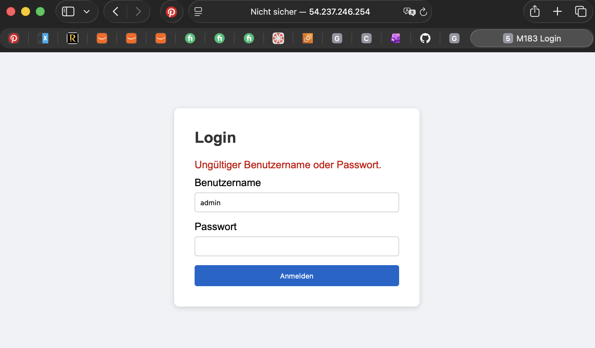

### Schritt 4 – Passwortliste erstellen

Danach wurde eine Passwortliste mit 20 möglichen Passwörtern erstellt. Das richtige Passwort war in dieser Liste enthalten.

Die Datei `passwords.txt` enthielt unter anderem folgende Einträge:

```text
password
123456
admin
letmein
qwerty
welcome
dragon
master
monkey
login
passw0rd
iloveyou
sunshine
shadow
superman
batman
trustno1
hello123
secret
password1
```

Das Passwort `sunshine` war an Position 13 in der Liste.

### Schritt 5 – Brute-Force-Script erstellen

Anschliessend wurde das Python-Script `brute.py` erstellt. Das Script liest die Passwortliste ein und sendet für jedes Passwort automatisch eine Login-Anfrage an die Web-App.

Die wichtigsten Werte im Script waren:

```python
TARGET  = "http://localhost/index.php"
USER    = "admin"
PWFILE  = "/home/ubuntu/bruteforce-app/passwords.txt"
```

Das Script prüft bei jedem Passwort, ob der Login erfolgreich war. Sobald das richtige Passwort gefunden wird, stoppt das Script.

### Schritt 6 – Angriff starten

Der Angriff wurde mit folgendem Befehl gestartet:

```bash
python3 ~/bruteforce-app/brute.py
```

Das Script testete die Passwörter aus der Liste automatisch durch. Beim 13. Versuch wurde das richtige Passwort gefunden:

```text
Ziel:    http://localhost/index.php
User:    admin
Wörter:  20
----------------------------------------
[ 13/20] Teste: sunshine
----------------------------------------
✓ Passwort gefunden: 'sunshine'
  Versuche: 13 | Zeit: 0.03s
```

Der Angriff benötigte also **13 Versuche** und dauerte nur **0.03 Sekunden**.

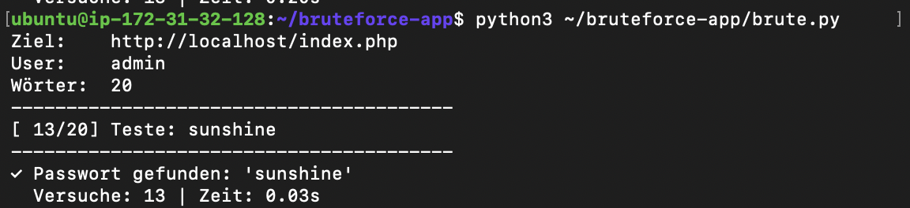

### Schritt 7 – Gefundenes Passwort verifizieren

Zum Schluss wurde das gefundene Passwort `sunshine` manuell im Browser eingegeben.

Der Login war erfolgreich und die App zeigte folgende Meldung:

```text
Login erfolgreich! Willkommen, admin.
```

Damit wurde bestätigt, dass das Brute-Force-Script das richtige Passwort gefunden hat.

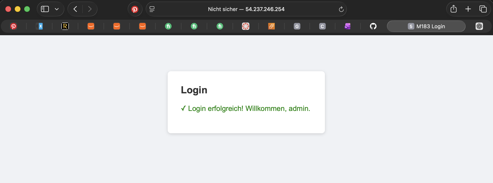

## Schriftliche Antworten

**1. Wie viele Versuche und wie viele Sekunden hat der Angriff benötigt? Was würde passieren, wenn die Passwortliste statt 20 Einträgen 1 Million hätte?**

Der Angriff benötigte **13 Versuche** und dauerte **0.03 Sekunden**.

Wenn die Passwortliste statt 20 Einträgen 1 Million Einträge hätte, würde das Script weiterhin automatisch alle Passwörter testen. Der Angriff würde länger dauern, aber ohne Schutzmassnahmen könnte das Passwort trotzdem gefunden werden, sobald es in der Liste vorkommt.

Bei bekannten Passwortlisten wie `rockyou.txt` wäre die Chance sehr hoch, schwache oder häufig verwendete Passwörter zu finden.

---

**2. Welche zwei technischen Massnahmen hätten diesen Angriff verhindert oder massgeblich erschwert?**

Eine wichtige Massnahme wäre **Rate-Limiting**. Dabei wird die Anzahl Login-Versuche begrenzt oder nach mehreren falschen Versuchen verlangsamt. Zum Beispiel könnte die App nach fünf falschen Versuchen eine Wartezeit einbauen.

Eine zweite Massnahme wäre **Account-Lockout**. Dabei wird ein Benutzerkonto nach mehreren falschen Login-Versuchen vorübergehend gesperrt. Dadurch kann ein Angreifer nicht unbegrenzt viele Passwörter ausprobieren.

---

**3. Warum ist das Passwort `sunshine` schwach – auch wenn es kein Wort wie `password` oder `123456` ist?**

Das Passwort `sunshine` ist schwach, weil es ein normales und häufig verwendetes Wort ist. Solche Wörter kommen oft in Passwortlisten vor und können deshalb mit einem Wörterbuchangriff schnell gefunden werden.

Auch wenn `sunshine` besser aussieht als `password` oder `123456`, ist es nicht zufällig genug. Ein sicheres Passwort sollte länger sein und nicht nur aus einem einfachen Wörterbuchwort bestehen.

## Fazit

Der Versuch zeigt, dass ein Login ohne Schutzmassnahmen sehr einfach angegriffen werden kann. Da die App kein Rate-Limiting und keinen Account-Lockout hatte, konnte das Python-Script automatisch mehrere Passwörter testen.

Das Passwort `sunshine` wurde bereits nach 13 Versuchen gefunden. Dadurch wird klar, warum sichere Passwörter und technische Schutzmassnahmen bei Login-Systemen wichtig sind.


## B – AES-256 symmetrische Verschlüsselung

Für diese Aufgabe wurde ein Python-Script erstellt, das eine Nachricht mit **AES-256-GCM** verschlüsselt und danach wieder entschlüsselt.

AES ist ein symmetrisches Verschlüsselungsverfahren. Das bedeutet, dass für das Verschlüsseln und Entschlüsseln derselbe Schlüssel verwendet wird. In dieser Aufgabe wurde ein 256-Bit-Schlüssel verwendet.

Der GCM-Modus sorgt zusätzlich dafür, dass Manipulationen am Ciphertext erkannt werden können.

### Schritt 1 – Python-Cryptography-Bibliothek installieren

Zuerst wurde die benötigte Python-Bibliothek installiert:

```bash
sudo apt update
sudo apt install python3-pip -y
sudo apt install python3-cryptography
```

Diese Bibliothek wird benötigt, damit AES-GCM in Python verwendet werden kann.

### Schritt 2 – AES-Script erstellen

Danach wurde die Datei `aes_demo.py` erstellt:

```bash
nano ~/aes_demo.py
```

Im Script wird zuerst ein zufälliger AES-256-Schlüssel generiert:

```python
key = AESGCM.generate_key(bit_length=256)
```

Ein AES-256-Schlüssel ist **256 Bit lang**, also **32 Bytes**.

Danach wird ein zufälliger Nonce erstellt:

```python
nonce = os.urandom(12)
```

Der Nonce ist in dieser Aufgabe **12 Bytes** lang. Er wird zusammen mit dem Schlüssel für die Verschlüsselung verwendet.

### Schritt 3 – Nachricht verschlüsseln

Als Klartext wurde folgende Nachricht verwendet:

```text
Dies ist eine geheime Nachricht fuer M183!
```

Diese Nachricht wurde mit AES-256-GCM verschlüsselt. Als Ausgabe wurden der Klartext, der Schlüssel, der Nonce und der Ciphertext angezeigt.

Der Ciphertext ist die verschlüsselte Form der Nachricht. Für einen Menschen ist er nicht mehr lesbar.

### Schritt 4 – Nachricht entschlüsseln

Nach der Verschlüsselung wurde der Ciphertext wieder mit demselben Schlüssel und demselben Nonce entschlüsselt.

Die Ausgabe zeigte wieder den ursprünglichen Klartext:

```text
Entschlüsselt: Dies ist eine geheime Nachricht fuer M183!
```

Damit wurde gezeigt, dass die Verschlüsselung und Entschlüsselung korrekt funktioniert haben.

### Schritt 5 – Manipulations-Test

Am Ende des Scripts wurde der Ciphertext absichtlich verändert:

```python
tampered[0] ^= 0xFF
```

Dadurch wurde das erste Byte des Ciphertexts manipuliert.

Danach wurde versucht, den manipulierten Ciphertext wieder zu entschlüsseln. Das hat nicht funktioniert. Die Ausgabe zeigte:

```text
Manipulations-Test:
→ GCM-Modus hat die Manipulation erkannt!
```

Das bedeutet, dass AES-GCM nicht nur verschlüsselt, sondern auch erkennt, wenn jemand die verschlüsselten Daten verändert hat.

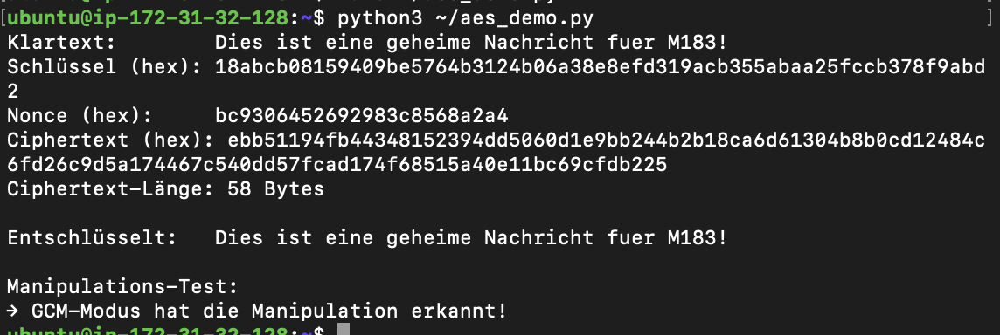

## Schriftliche Antworten

**1. Was ist ein Nonce und warum muss er für jede Verschlüsselung neu generiert werden?**

Ein Nonce ist ein zufälliger Wert, der zusammen mit dem Schlüssel für die Verschlüsselung verwendet wird.

Der Nonce muss bei jeder Verschlüsselung neu generiert werden, damit nicht zweimal dieselbe Kombination aus Schlüssel und Nonce verwendet wird. Wenn derselbe Nonce mit demselben Schlüssel mehrfach verwendet wird, kann die Sicherheit der Verschlüsselung gefährdet werden.

Der Nonce muss nicht geheim sein, aber er muss eindeutig sein.

---

**2. Was ist der Unterschied zwischen DES und AES-256 in Bezug auf Brute-Force-Resistenz?**

DES verwendet nur einen **56-Bit-Schlüssel**. Dieser Schlüsselraum ist heute zu klein und kann mit moderner Hardware per Brute Force durchsucht werden.

AES-256 verwendet einen **256-Bit-Schlüssel**. Dadurch gibt es extrem viele mögliche Schlüssel. Ein Brute-Force-Angriff gegen AES-256 ist praktisch nicht realistisch, weil das Ausprobieren aller Schlüssel viel zu lange dauern würde.

AES-256 ist deshalb deutlich sicherer als DES.

---

**3. Was demonstriert der Manipulations-Test am Ende des Skripts? Welchen Vorteil bietet GCM gegenüber einfachem AES-CBC?**

Der Manipulations-Test zeigt, dass AES-GCM erkennt, wenn der Ciphertext verändert wurde.

Im Script wurde ein Byte des Ciphertexts absichtlich geändert. Danach konnte die Nachricht nicht mehr erfolgreich entschlüsselt werden. Der GCM-Modus hat die Manipulation erkannt.

Der Vorteil von GCM gegenüber einfachem AES-CBC ist, dass GCM zusätzlich zur Verschlüsselung auch die Integrität prüft. Das bedeutet: Ein Angreifer kann die verschlüsselten Daten nicht unbemerkt verändern.

Bei einfachem AES-CBC braucht man dafür zusätzliche Schutzmechanismen, zum Beispiel einen separaten MAC.

## C – PKI-Zertifikatskette mit OpenSSL

Für diese Aufgabe wurde mit OpenSSL eine eigene kleine PKI erstellt. Dabei wurde zuerst eine eigene Root CA erstellt. Danach wurde ein Server-Zertifikat für meine EC2-IP erzeugt und von dieser Root CA signiert.

Ziel war es zu zeigen, wie eine Zertifikatskette funktioniert und wie ein Server-Zertifikat mit einer CA überprüft werden kann.

### Schritt 1 – OpenSSL installieren und Ordner erstellen

Zuerst wurde OpenSSL installiert und ein neuer Ordner für die PKI erstellt:

```bash
sudo apt install openssl -y
mkdir -p ~/pki/{ca,server} && cd ~/pki
```

Im Ordner `ca` wurden die Dateien der Root CA gespeichert. Im Ordner `server` wurden die Dateien für das Server-Zertifikat gespeichert.

### Schritt 2 – Root CA erstellen

Danach wurde zuerst der private Schlüssel der Root CA erstellt:

```bash
openssl genrsa -out ca/ca.key 4096
```

Anschliessend wurde ein selbstsigniertes Root-Zertifikat erstellt:

```bash
openssl req -new -x509 -days 3650 -key ca/ca.key -out ca/ca.crt \
  -subj "/C=CH/ST=Zuerich/O=TBZ-M183-CA/CN=M183 Root CA"
```

Diese Root CA ist der Vertrauensanker in dieser Aufgabe. Sie stellt später das Server-Zertifikat aus.

### Schritt 3 – Server-Zertifikat erstellen

Danach wurde der private Schlüssel für den Server erstellt:

```bash
openssl genrsa -out server/server.key 2048
```

Anschliessend wurde ein CSR erstellt. CSR bedeutet **Certificate Signing Request**. Das ist ein Antrag an die CA, ein Zertifikat auszustellen.

```bash
openssl req -new -key server/server.key -out server/server.csr \
  -subj "/C=CH/ST=Zuerich/O=TBZ-M183/CN=$(curl -s ifconfig.me)"
```

Als Common Name wurde meine öffentliche EC2-IP verwendet:

```text
CN=54.237.246.254
```

### Schritt 4 – Server-Zertifikat mit der CA signieren

Die Root CA hat danach das Server-Zertifikat signiert:

```bash
openssl x509 -req -days 365 \
  -in server/server.csr \
  -CA ca/ca.crt -CAkey ca/ca.key -CAcreateserial \
  -out server/server.crt
```

Dadurch wurde aus dem CSR ein echtes Server-Zertifikat erstellt. Dieses Zertifikat ist ein Jahr gültig.

Danach wurde noch eine Zertifikatskette erstellt:

```bash
cat server/server.crt ca/ca.crt > server/chain.crt
```

Diese Datei enthält das Server-Zertifikat und das Root-CA-Zertifikat zusammen.

### Schritt 5 – Zertifikat prüfen

Zum Schluss wurden die Zertifikatsdetails angezeigt:

```bash
openssl x509 -in server/server.crt -text -noout | grep -A5 "Subject\\|Issuer\\|Validity\\|Public Key"
```

In der Ausgabe sieht man den Aussteller des Zertifikats:

```text
Issuer: C=CH, ST=Zuerich, O=TBZ-M183-CA, CN=M183 Root CA
```

Das bedeutet, dass das Server-Zertifikat von meiner eigenen Root CA ausgestellt wurde.

Man sieht auch die Gültigkeit:

```text
Not Before: Jul  5 16:35:19 2026 GMT
Not After : Jul  5 16:35:19 2027 GMT
```

Das Zertifikat ist also ein Jahr gültig.

Als Subject wurde meine EC2-IP eingetragen:

```text
Subject: C=CH, ST=Zuerich, O=TBZ-M183, CN=54.237.246.254
```

Zusätzlich sieht man, dass das Server-Zertifikat einen RSA-Schlüssel mit 2048 Bit verwendet:

```text
Public Key Algorithm: rsaEncryption
Public-Key: (2048 bit)
```

Danach wurde die Zertifikatskette überprüft:

```bash
openssl verify -CAfile ca/ca.crt server/server.crt
```

Die Ausgabe war:

```text
server/server.crt: OK
```

Das bedeutet, dass das Server-Zertifikat erfolgreich mit der eigenen Root CA verifiziert werden konnte.

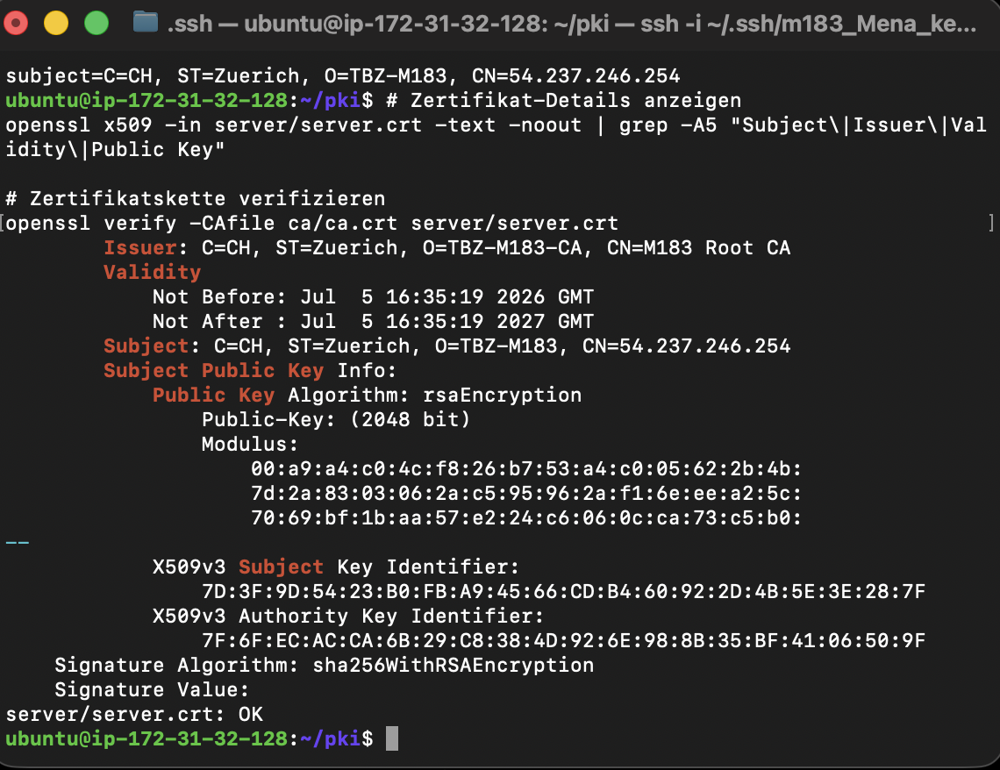

## Schriftliche Antworten

**1. Was ist der Unterschied zwischen einem selbstsignierten Zertifikat und einem CA-signierten Zertifikat?**

Ein selbstsigniertes Zertifikat wird mit dem eigenen privaten Schlüssel signiert. Der Aussteller und der Besitzer des Zertifikats sind dabei dieselbe Stelle. Deshalb vertraut ein Browser so einem Zertifikat nicht automatisch.

Ein CA-signiertes Zertifikat wird von einer Certificate Authority signiert. Wenn diese CA vom Browser als vertrauenswürdig eingestuft wird, vertraut der Browser auch dem Server-Zertifikat.

In dieser Aufgabe wurde die Root CA selbst erstellt. Das Server-Zertifikat ist zwar von meiner Root CA signiert, aber diese Root CA ist nicht im Browser als vertrauenswürdig hinterlegt.

---

**2. Was enthält ein CSR und wozu dient er?**

Ein CSR ist ein Certificate Signing Request. Er enthält die Informationen, die später im Zertifikat stehen sollen, zum Beispiel Land, Organisation und Common Name.

In meinem Fall war der Common Name die öffentliche EC2-IP:

```text
CN=54.237.246.254
```

Zusätzlich enthält der CSR den öffentlichen Schlüssel des Servers. Die CA verwendet diesen Antrag, um daraus ein signiertes Server-Zertifikat zu erstellen.

---

**3. Warum vertraut ein normaler Browser dem selbst erstellten Zertifikat nicht, obwohl es technisch korrekt erstellt wurde?**

Ein Browser vertraut nur Zertifikaten, die zu einer bekannten und vertrauenswürdigen Root CA zurückgeführt werden können. Diese vertrauenswürdigen Root CAs sind im Betriebssystem oder Browser bereits gespeichert.

Meine Root CA `M183 Root CA` wurde selbst erstellt und ist nicht im Browser hinterlegt. Deshalb erkennt der Browser die Zertifikatskette nicht als vertrauenswürdig.

Das Zertifikat ist technisch korrekt erstellt und kann mit OpenSSL erfolgreich geprüft werden, aber der Browser vertraut der eigenen Root CA nicht automatisch.

## D – Nginx mit TLS konfigurieren

Für diese Aufgabe wurde ein Nginx-Webserver mit TLS gestartet. Dafür wurde das Server-Zertifikat aus Aufgabe C verwendet.

Ziel war es zu zeigen, wie eine Webseite über **HTTPS** erreichbar gemacht wird. HTTPS verwendet hybride Verschlüsselung: Der sichere Schlüsselaustausch erfolgt asymmetrisch, die eigentliche Datenübertragung danach symmetrisch.

### Schritt 1 – Port 443 freigeben

Zuerst wurde in AWS die Security Group angepasst. Unter **Inbound rules** wurde eine neue Regel für HTTPS hinzugefügt.

Die Regel wurde so gesetzt:

```text
Type: HTTPS
Protocol: TCP
Port range: 443
Source: My IP
```

Damit darf die EC2-Instanz HTTPS-Verbindungen über Port `443` von meiner IP-Adresse annehmen.

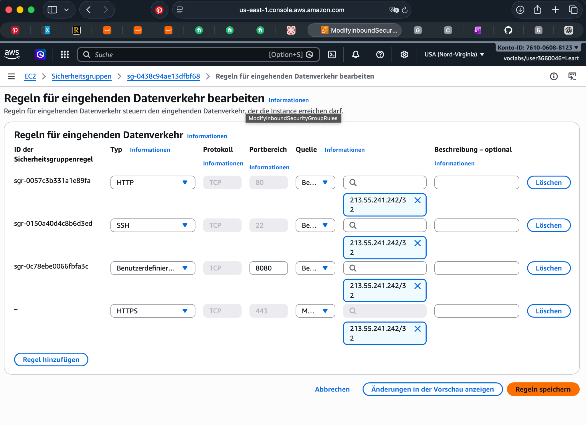

### Schritt 2 – Nginx mit TLS starten

Danach wurde ein Nginx-Container gestartet. Dabei wurden das Server-Zertifikat, der private Schlüssel und das CA-Zertifikat in den Container eingebunden:

```bash
docker run -d \
  --name nginx-tls \
  -p 443:443 \
  -v ~/pki/server/chain.crt:/etc/nginx/ssl/server.crt:ro \
  -v ~/pki/server/server.key:/etc/nginx/ssl/server.key:ro \
  -v ~/pki/ca/ca.crt:/etc/nginx/ssl/ca.crt:ro \
  nginx:alpine
```

Der Container hört auf Port `443`. Das ist der Standard-Port für HTTPS.

### Schritt 3 – TLS-Konfiguration erstellen

Anschliessend wurde im Nginx-Container die TLS-Konfiguration erstellt.

In der Konfiguration wurde festgelegt, dass Nginx auf Port `443` mit SSL/TLS laufen soll:

```nginx
server {
    listen 443 ssl;
    server_name _;

    ssl_certificate     /etc/nginx/ssl/server.crt;
    ssl_certificate_key /etc/nginx/ssl/server.key;
    ssl_protocols       TLSv1.2 TLSv1.3;
    ssl_ciphers         HIGH:!aNULL:!MD5;

    location / {
        return 200 "<h1>M183 KN03 – TLS funktioniert!</h1><p>Hybride Verschlüsselung aktiv.</p>";
        add_header Content-Type text/html;
    }
}
```

Wichtig sind hier vor allem diese Zeilen:

```nginx
ssl_certificate     /etc/nginx/ssl/server.crt;
ssl_certificate_key /etc/nginx/ssl/server.key;
ssl_protocols       TLSv1.2 TLSv1.3;
```

Damit verwendet Nginx das selbst erstellte Server-Zertifikat und erlaubt nur moderne TLS-Versionen.

Danach wurde Nginx neu geladen:

```bash
docker exec nginx-tls nginx -s reload
```

### Schritt 4 – HTTPS-Seite im Browser aufrufen

Danach wurde die Webseite im Browser über HTTPS geöffnet:

```text
https://54.237.246.254
```

Die Seite wurde erfolgreich geladen. Im Browser war sichtbar, dass die Verbindung über die EC2-IP läuft.

Auf der Webseite stand:

```text
M183 KN03 – TLS funktioniert!
Hybride Verschlüsselung aktiv.
```

Im Screenshot sieht man zusätzlich oben im Browser den Hinweis **Nicht sicher**. Das liegt daran, dass das Zertifikat zwar technisch funktioniert, aber von meiner eigenen Root CA signiert wurde. Diese Root CA ist im Browser nicht als vertrauenswürdig gespeichert.

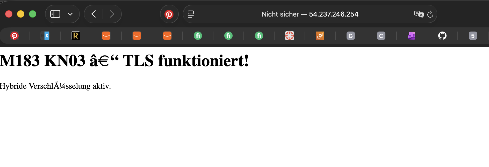

Die komischen Sonderzeichen auf der Seite entstehen nur durch die Zeichencodierung im HTML. Für die TLS-Funktion ist das nicht relevant.

## Schriftliche Antworten

**1. Welche Informationen zeigt der Browser im Zertifikat-Dialog? Was davon wurde selbst in Aufgabe C definiert?**

Der Browser zeigt im Zertifikat-Dialog Informationen zum Zertifikat an. Dazu gehören zum Beispiel der Common Name, der Aussteller und die Gültigkeit.

Selbst definiert wurden in Aufgabe C unter anderem diese Angaben:

```text
Subject: C=CH, ST=Zuerich, O=TBZ-M183, CN=54.237.246.254
Issuer:  C=CH, ST=Zuerich, O=TBZ-M183-CA, CN=M183 Root CA
```

Der Common Name ist die öffentliche EC2-IP:

```text
CN=54.237.246.254
```

Der Aussteller ist meine eigene Root CA:

```text
CN=M183 Root CA
```

Auch die Gültigkeit wurde beim Erstellen des Zertifikats festgelegt.

---

**2. Warum erscheint trotz technisch korrektem Zertifikat eine Sicherheitswarnung?**

Die Sicherheitswarnung erscheint, weil der Browser meiner selbst erstellten Root CA nicht automatisch vertraut.

Das Zertifikat wurde zwar technisch korrekt erstellt und von meiner eigenen Root CA signiert. Diese Root CA ist aber nicht im Browser oder Betriebssystem als vertrauenswürdige Certificate Authority hinterlegt.

Deshalb kann der Browser die Zertifikatskette nicht als vertrauenswürdig einstufen und zeigt den Hinweis **Nicht sicher** an.

---

**3. Wie funktioniert hybride Verschlüsselung bei HTTPS in diesem Setup?**

Bei HTTPS werden asymmetrische und symmetrische Verschlüsselung kombiniert.

Am Anfang der Verbindung findet der TLS-Handshake statt. Dabei verwendet der Server sein Zertifikat und seinen öffentlichen Schlüssel. Der Browser prüft das Zertifikat und handelt mit dem Server sicher einen gemeinsamen Sitzungsschlüssel aus.

Dieser erste Teil funktioniert asymmetrisch. Danach wird für die eigentliche Datenübertragung ein symmetrischer Schlüssel verwendet, zum Beispiel mit AES.

Das ist effizienter, weil symmetrische Verschlüsselung schneller ist als asymmetrische Verschlüsselung. Die asymmetrische Verschlüsselung wird also vor allem für den sicheren Schlüsselaustausch verwendet, die symmetrische Verschlüsselung danach für die Datenübertragung.

## E – HTTP vs. HTTPS – Traffic live mitlesen

In dieser Aufgabe wurde untersucht, welche Dienste auf der EC2-Instanz offen sind. Dafür wurde zuerst ein Port-Scan mit `nmap` durchgeführt.

Ziel war es zu sehen, welche Ports von aussen oder lokal erreichbar sind und welche Informationen ein Angreifer bereits durch einen einfachen Scan erhalten kann.

### Schritt 1 – Nmap-Scan durchführen

Zuerst wurden `nmap` und `tcpdump` auf der Instanz installiert:

```bash
sudo apt install nmap tcpdump -y
```

Danach wurde die eigene Instanz lokal gescannt:

```bash
nmap -sV localhost
```

Der Parameter `-sV` bedeutet, dass `nmap` nicht nur prüft, welche Ports offen sind, sondern auch versucht, den laufenden Dienst und die Version zu erkennen.

Die Ausgabe zeigte folgende offene Ports:

```text
PORT    STATE SERVICE  VERSION
22/tcp  open  ssh      OpenSSH 10.2p1 Ubuntu 2ubuntu3.2
443/tcp open  ssl/http nginx 1.31.2
```

Ausserdem zeigte `nmap`, dass 998 TCP-Ports geschlossen waren:

```text
Not shown: 998 closed tcp ports (conn-refused)
```

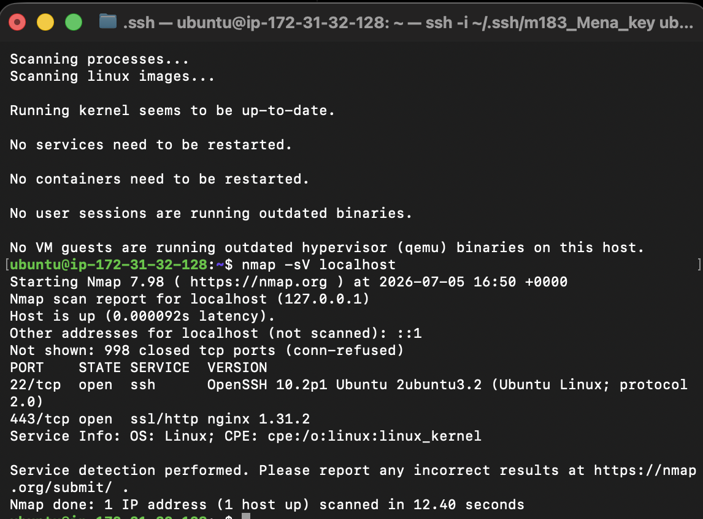

### Beobachtung

Der Scan zeigt, dass auf der Instanz der SSH-Dienst auf Port `22` läuft. Dieser Port wird für die Verbindung zur EC2-Instanz verwendet.

Zusätzlich ist Port `443` offen. Dort läuft ein Nginx-Webserver mit HTTPS/TLS:

```text
443/tcp open ssl/http nginx 1.31.2
```

Port `80` wurde in meinem Screenshot nicht als offen angezeigt. Das bedeutet, dass die HTTP-Login-App zu diesem Zeitpunkt entweder nicht mehr lief oder nicht mehr über Port `80` erreichbar war.

Für die nächste Aufgabe mit HTTP-Traffic müsste der PHP-Container auf Port `80` wieder laufen, damit `tcpdump` den unverschlüsselten Login-Verkehr mitlesen kann.

## Schriftliche Antwort

**1. Was zeigt nmap über Port 80 und Port 443? Welche Information erhält ein Angreifer bereits durch einen Port-Scan, bevor er auch nur eine einzige Anfrage an die App gestellt hat?**

In meinem Scan wurde Port `443` als offen angezeigt. Auf diesem Port läuft ein HTTPS-Dienst mit Nginx:

```text
443/tcp open ssl/http nginx 1.31.2
```

Port `80` wurde nicht angezeigt. Das bedeutet, dass der HTTP-Dienst zu diesem Zeitpunkt nicht erreichbar war oder der Container nicht lief.

Ein Angreifer sieht durch einen Port-Scan bereits, welche Dienste auf einem System erreichbar sind. In meinem Fall erkennt man zum Beispiel, dass SSH auf Port `22` offen ist und dass ein Nginx-Webserver über HTTPS auf Port `443` läuft.

Zusätzlich erkennt ein Angreifer teilweise auch die Versionen der Dienste. Diese Informationen können gefährlich sein, weil ein Angreifer danach gezielt nach bekannten Schwachstellen für diese Versionen suchen könnte.

### Schritt 2 – tcpdump: HTTP-Traffic mitlesen

Für diesen Schritt wurden zwei SSH-Terminals gleichzeitig geöffnet. Im ersten Terminal wurde `tcpdump` gestartet, damit der HTTP-Verkehr auf Port `80` mitgelesen werden kann.

Der verwendete Befehl war:

```bash
sudo tcpdump -i any -A port 80 2>/dev/null
```

Die Option `-i any` sorgt dafür, dass auf allen Netzwerkinterfaces mitgelesen wird. Mit `-A` wird der Inhalt im ASCII-Format angezeigt. Dadurch kann man bei HTTP den Inhalt der Anfrage im Klartext sehen.

Im zweiten Terminal wurde danach ein Login-Request mit `curl` gesendet:

```bash
curl -s -o /dev/null -X POST http://54.237.246.254/ \
  -d "username=admin&password=sunshine"
```

Dabei wurden Benutzername und Passwort direkt im HTTP-Request mitgeschickt.

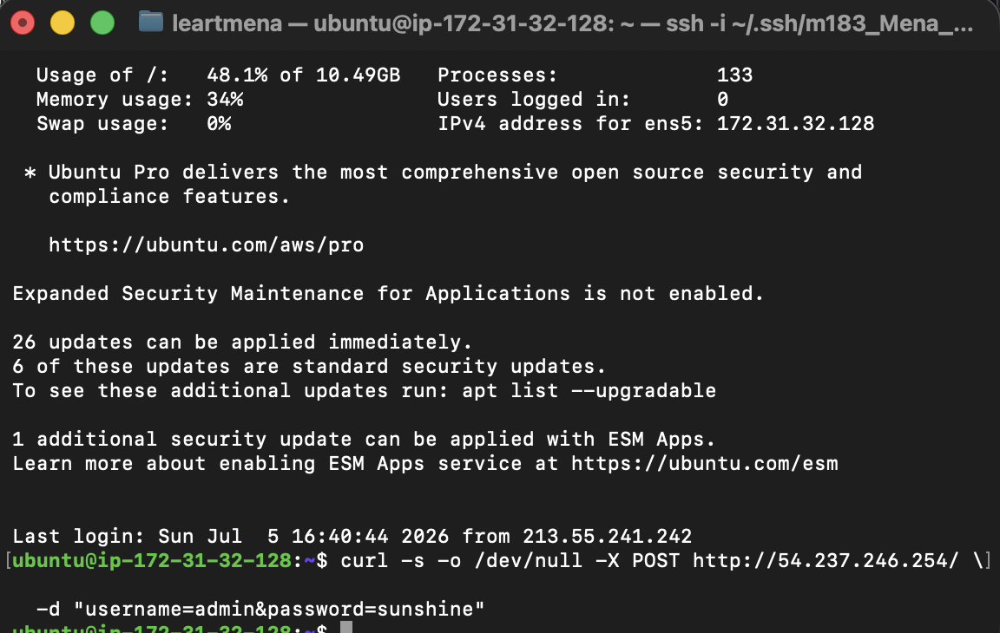

Im `tcpdump`-Output sieht man, dass Traffic über Port `80` erzeugt wurde. Da HTTP unverschlüsselt ist, kann der Inhalt grundsätzlich im Klartext mitgelesen werden.

In meinem Screenshot sieht man vor allem den Verbindungsaufbau über Port `80`:

```text
IP ip-172-31-32-128.ec2.internal.50540 > ec2-54-237-246-254.compute-1.amazonaws.com.http
Flags [S]
```

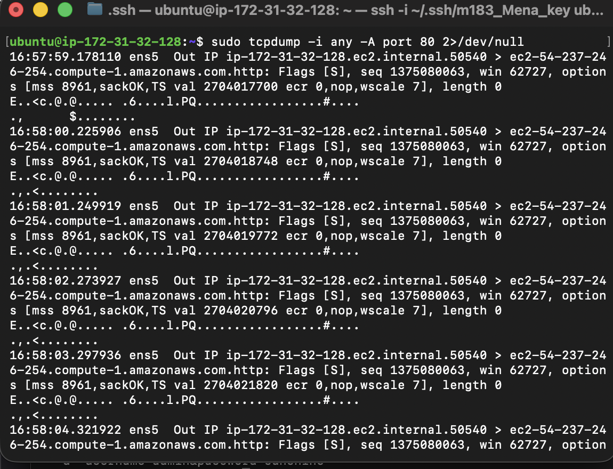

Für die Abgabe ist wichtig, dass im tcpdump-Output zusätzlich die POST-Daten sichtbar sind. Dort sollte die Zeile mit Benutzername und Passwort im Klartext erscheinen:

```text
username=admin&password=sunshine
```

Diese Zeile zeigt das Sicherheitsproblem von HTTP: Die Zugangsdaten werden nicht verschlüsselt übertragen und können deshalb mitgelesen werden.

## Schriftliche Antworten

**2. Was genau ist im tcpdump-Output sichtbar? Markieren Sie die Zeile, die das Passwort im Klartext enthält.**

Im tcpdump-Output ist der HTTP-Verkehr auf Port `80` sichtbar. Bei HTTP werden die Daten unverschlüsselt übertragen. Deshalb können bei einem POST-Request auch die Formulardaten im Klartext sichtbar sein.

Die wichtige Zeile ist:

```text
username=admin&password=sunshine
```

Darin sieht man den Benutzernamen `admin` und das Passwort `sunshine` direkt im Klartext. Genau das ist das Problem bei HTTP.

---

**3. Was müsste ein Angreifer in einem realen Netzwerk tun, um diesen Traffic mitzulesen?**

Ein Angreifer müsste sich im gleichen Netzwerk befinden oder den Netzwerkverkehr über sich selbst umleiten.

In einem lokalen Netzwerk könnte er zum Beispiel **ARP-Spoofing** durchführen. Dabei täuscht der Angreifer dem Opfer vor, dass sein Gerät das Gateway ist. Gleichzeitig täuscht er dem Router vor, dass sein Gerät das Opfer ist.

Dadurch läuft der Datenverkehr über den Angreifer. Das nennt man **Man-in-the-Middle-Angriff**. Wenn die Verbindung nur HTTP verwendet, kann der Angreifer die übertragenen Daten wie Benutzername und Passwort im Klartext mitlesen.

### Schritt 3 – tcpdump: HTTPS-Traffic mitlesen

In diesem Schritt wurde derselbe Login-Request nochmals gesendet, diesmal aber über **HTTPS** auf Port `443`.

Dafür wurden wieder zwei SSH-Terminals verwendet. Im ersten Terminal wurde `tcpdump` für Port `443` gestartet:

```bash
sudo tcpdump -i any -A port 443 2>/dev/null
```

Im zweiten Terminal wurde der HTTPS-Request mit `curl` gesendet:

```bash
curl -s -o /dev/null -k -X POST https://54.237.246.254/ \
  -d "username=admin&password=sunshine"
```

Das Flag `-k` wurde verwendet, weil das Zertifikat selbst erstellt wurde und vom Browser beziehungsweise System nicht automatisch vertraut wird.

Im `tcpdump`-Output sieht man zwar weiterhin Netzwerkverkehr auf Port `443`, aber der Inhalt ist nicht mehr als Klartext lesbar. Es werden nur Verbindungsinformationen und unlesbare Zeichen angezeigt.

Im Gegensatz zu HTTP sieht man hier **nicht** direkt:

```text
username=admin&password=sunshine
```

Das Passwort ist also im Mitschnitt nicht sichtbar.

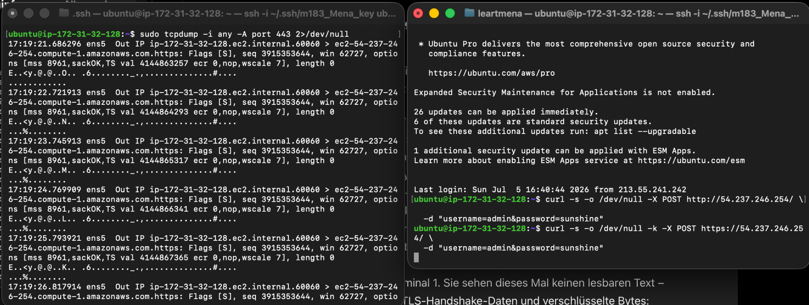

## Schriftliche Antworten

**4. Was ist der Unterschied zwischen dem tcpdump-Output auf Port 80 und Port 443? Was sieht ein Angreifer beim HTTPS-Traffic?**

Bei Port `80` wird HTTP verwendet. HTTP ist unverschlüsselt. Deshalb können Benutzername und Passwort im tcpdump-Output im Klartext sichtbar sein.

Bei Port `443` wird HTTPS verwendet. HTTPS verschlüsselt die übertragenen Daten mit TLS. Deshalb sieht man im tcpdump-Output keine lesbaren Formulardaten mehr.

Ein Angreifer sieht beim HTTPS-Traffic höchstens technische Verbindungsinformationen, IP-Adressen, Ports und verschlüsselte Daten. Den Benutzernamen und das Passwort kann er nicht einfach im Klartext mitlesen.

---

**5. Was passiert beim TLS-Handshake, bevor die eigentlichen Daten übertragen werden?**

Bevor Benutzername und Passwort übertragen werden, findet zuerst der TLS-Handshake statt.

Dabei zeigt der Server sein Zertifikat. Der Client prüft dieses Zertifikat und handelt danach mit dem Server einen gemeinsamen Sitzungsschlüssel aus.

Dieser Schlüsselaustausch basiert auf asymmetrischer Kryptographie. Danach wird für die eigentliche Datenübertragung symmetrische Verschlüsselung verwendet, zum Beispiel AES.

Das nennt man hybride Verschlüsselung:
Asymmetrische Verschlüsselung wird für den sicheren Schlüsselaustausch verwendet, symmetrische Verschlüsselung danach für die schnelle Datenübertragung.

---

**6. Warum sieht man bei Port 443 trotzdem noch IP-Adressen von Client und Server?**

Die IP-Adressen müssen sichtbar bleiben, weil Router und Netzwerke sonst nicht wissen würden, wohin die Datenpakete geschickt werden müssen.

TLS verschlüsselt den Inhalt der Verbindung, also zum Beispiel Benutzername, Passwort und HTTP-Daten. Die Verbindungsinformationen auf Netzwerkebene, wie Quell-IP, Ziel-IP und Port, bleiben aber sichtbar.

Darum kann ein Angreifer sehen, dass eine Verbindung zu einem Server aufgebaut wurde. Er kann aber nicht sehen, welche Login-Daten übertragen wurden.

## F – Hash-Funktionen: MD5 cracken mit Python

Für diese Aufgabe wurde gezeigt, warum MD5 für Passwortspeicherung unsicher ist. Dafür wurde eine simulierte Passwort-Datenbank mit MD5-Hashes erstellt und anschliessend mit einem Python-Script und einer Passwortliste angegriffen.

Ziel war es zu zeigen, dass MD5 sehr schnell berechnet werden kann. Dadurch können schwache Passwörter mit einem Wörterbuchangriff sehr schnell gefunden werden.

### Schritt 1 – MD5-Hash-Datenbank erstellen

Zuerst wurde eine simulierte gestohlene Passwort-Datenbank erstellt. In dieser Datei stehen keine Klartext-Passwörter, sondern nur Benutzername und MD5-Hash.

Die Datei wurde so erstellt:

```bash
cat > ~/hashes_md5.txt << 'EOF'
alice:0571749e2ac330a7455809c6b0e7af90
bob:8621ffdbc5698829397d97767ac13db3
carol:f25a2fc72690b780b2a14e140ef6a9e0
dave:0d107d09f5bbe40cade3de5c71e9e9b7
eve:4ece57a61323b52ccffdbef021956754
frank:e9f5bd2bae1c70770ff8c6e6cf2d7b76
EOF
```

Das Format ist:

```text
benutzername:hash
```

Ein Angreifer kennt in diesem Fall also nur die Hashes, aber noch nicht die echten Passwörter.

### Schritt 2 – Cracker-Script erstellen

Danach wurde das Python-Script `crack_md5.py` erstellt. Das Script liest die Hashes ein und vergleicht sie mit den MD5-Hashes aus der Passwortliste.

Da die Dateien im Benutzerordner `ubuntu` liegen, wurden die Pfade im Script so gesetzt:

```python
HASHFILE  = "/home/ubuntu/hashes_md5.txt"
WORDLIST  = "/home/ubuntu/bruteforce-app/passwords.txt"
```

Das Script berechnet für jedes Wort aus der Passwortliste den MD5-Hash. Wenn dieser Hash mit einem Hash aus der Datei übereinstimmt, wurde das Passwort gefunden.

### Schritt 3 – Angriff mit der ersten Passwortliste starten

Der Angriff wurde mit folgendem Befehl gestartet:

```bash
python3 ~/crack_md5.py
```

Das Wörterbuch hatte zuerst 20 Einträge. Das Script konnte 4 von 6 Hashes knacken:

```text
Ziel-Hashes: 6
Wörterbuch: 20 Einträge

✓ dave   → 'letmein'
✓ bob    → 'dragon'
✓ carol  → 'iloveyou'
✓ alice  → 'sunshine'

Geknackt: 4/6 | Zeit: 0.1 ms
Hashes/Sekunde: 149,530
```

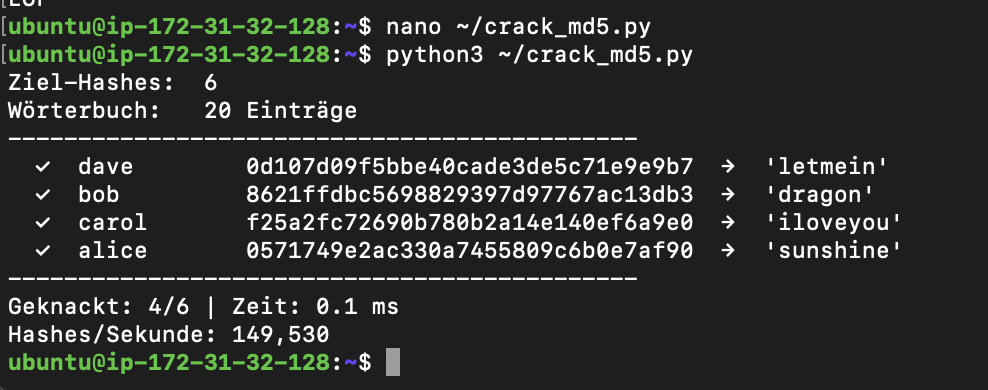

Es wurden also die Passwörter von `alice`, `bob`, `carol` und `dave` gefunden. Die Benutzer `eve` und `frank` wurden nicht geknackt.

### Schritt 4 – Franks Passwort prüfen

Danach wurde der Hash von `frank` überprüft. Dazu wurde das Passwort `correcthorsebatterystaple` mit MD5 gehasht:

```bash
echo -n "correcthorsebatterystaple" | md5sum
```

Die Ausgabe war:

```text
e9f5bd2bae1c70770ff8c6e6cf2d7b76
```

Dieser Hash stimmt mit dem Hash von `frank` überein. Das Passwort von `frank` ist also:

```text
correcthorsebatterystaple
```

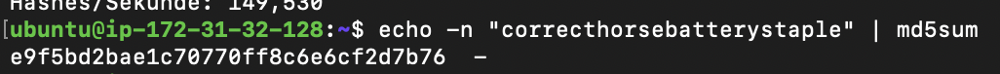

Der Grund, warum `frank` vorher nicht geknackt wurde, ist nicht, dass MD5 sicher ist. Das Passwort stand einfach nicht in der verwendeten Passwortliste.

### Schritt 5 – Angriff mit erweiterter Wortliste

Danach wurde die Passwortliste um 10 weitere häufige Passwörter erweitert:

```bash
cat >> ~/bruteforce-app/passwords.txt << 'EOF'
starwars
football
baseball
princess
abc123
passw0rd1
liverpool
qwertyuiop
654321
mustang
EOF
```

Danach wurde der Angriff erneut gestartet:

```bash
python3 ~/crack_md5.py
```

Das Wörterbuch hatte nun 30 Einträge. Trotzdem wurden wieder nur 4 von 6 Hashes geknackt:

```text
Ziel-Hashes: 6
Wörterbuch: 30 Einträge

✓ dave   → 'letmein'
✓ bob    → 'dragon'
✓ carol  → 'iloveyou'
✓ alice  → 'sunshine'

Geknackt: 4/6 | Zeit: 0.1 ms
Hashes/Sekunde: 227,951
```

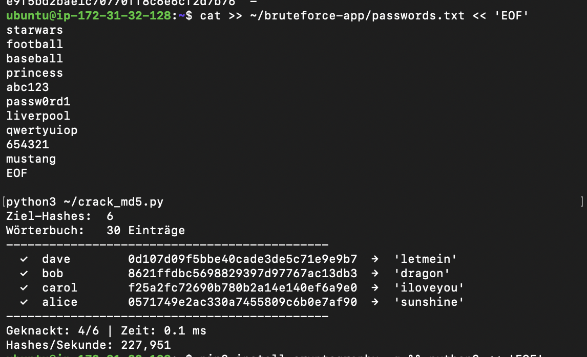

Es wurden also keine neuen Passwörter gefunden. Die zusätzlichen Wörter enthielten nicht die Passwörter von `eve` oder `frank`.

### Schritt 6 – Vergleich MD5 und scrypt

Zum Schluss wurde verglichen, wie schnell MD5 im Vergleich zu scrypt ist. scrypt ist ein langsamer Passwort-Hashing-Algorithmus und ist vom Prinzip her mit Argon2ID vergleichbar.

Die Ausgabe zeigte:

```text
MD5:       1,565,763 Hashes/Sekunde
scrypt:        20.4 Hashes/Sekunde

MD5 ist 76,924x schneller als scrypt.

rockyou.txt (14 Mio. Eintraege) cracken:
  Mit MD5:    8.9 Sekunden
  Mit scrypt: 191 Stunden
```

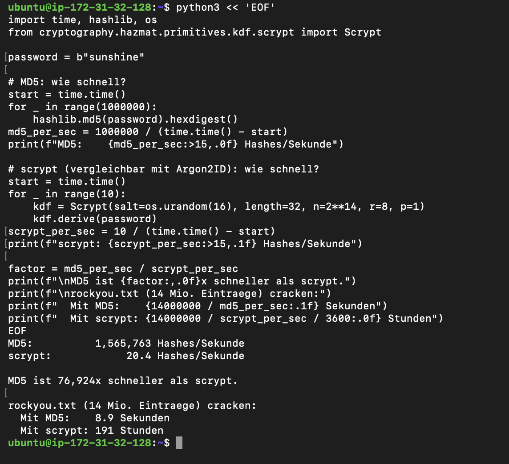

Der Vergleich zeigt sehr deutlich, warum MD5 für Passwörter ungeeignet ist. MD5 ist extrem schnell und kann deshalb sehr schnell mit grossen Passwortlisten angegriffen werden.

## Schriftliche Antworten

**1. Welche Passwörter wurden geknackt, welche nicht? Was unterscheidet die knackbaren Passwörter von franks Passwort?**

Geknackt wurden diese Passwörter:

```text
alice  → sunshine
bob    → dragon
carol  → iloveyou
dave   → letmein
```

Nicht geknackt wurden zuerst:

```text
eve
frank
```

Franks Passwort ist:

```text
correcthorsebatterystaple
```

Dieses Passwort wurde nicht geknackt, weil es nicht in der verwendeten Passwortliste enthalten war. Die anderen Passwörter wie `sunshine`, `dragon`, `iloveyou` und `letmein` sind typische Wörter aus Passwortlisten. Deshalb konnten sie sehr schnell gefunden werden.

Franks Passwort ist länger und besteht aus mehreren Wörtern. Dadurch ist es deutlich schwerer mit einer kleinen Wortliste zu finden.

---

**2. Wie lange würde der gleiche Angriff mit rockyou.txt dauern?**

Im ersten Test wurden ungefähr **149,530 Hashes pro Sekunde** gemessen. Die bekannte `rockyou.txt`-Liste hat ungefähr **14 Millionen Einträge**.

Mit der späteren Messung aus Schritt 6 wurde berechnet, dass `rockyou.txt` mit MD5 ungefähr so lange dauern würde:

```text
Mit MD5: 8.9 Sekunden
```

Das zeigt, dass MD5 extrem schnell ist. Eine grosse Passwortliste kann damit in kurzer Zeit durchprobiert werden.

Mit scrypt würde der gleiche Angriff viel länger dauern:

```text
Mit scrypt: 191 Stunden
```

---

**3. Franks Passwort ist lang und steht in keiner Wortliste. Welche zwei Massnahmen machen gestohlene Hashes unbrauchbar, selbst wenn der Angreifer sie hat?**

Die erste wichtige Massnahme ist ein **Salt**. Ein Salt ist ein zufälliger Wert, der zu jedem Passwort hinzugefügt wird, bevor es gehasht wird. Dadurch haben gleiche Passwörter nicht mehr automatisch denselben Hash. Ausserdem werden Rainbow-Tables dadurch praktisch unbrauchbar.

Die zweite wichtige Massnahme ist ein **langsamer Passwort-Hashing-Algorithmus** wie **Argon2ID**, **bcrypt** oder **scrypt**. Diese Algorithmen sind absichtlich langsam und teilweise speicherintensiv. Dadurch wird ein Brute-Force- oder Wörterbuchangriff viel aufwändiger.

MD5 ist dafür ungeeignet, weil es viel zu schnell ist. In meinem Test war MD5 ungefähr **76,924-mal schneller** als scrypt.

## Fazit

Diese Aufgabe zeigt, dass MD5 für Passwortspeicherung nicht mehr sicher ist. Schwache Passwörter konnten in wenigen Millisekunden gefunden werden.

Auch längere Passwörter sind grundsätzlich knackbar, wenn sie in einer passenden Wortliste vorkommen. Darum sollte man Passwörter nie mit MD5 speichern, sondern mit Salt und einem langsamen Passwort-Hashing-Verfahren wie Argon2ID, bcrypt oder scrypt.
